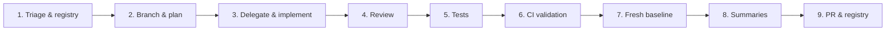

# Agent Workflow

How AI agents (and humans pairing with them) ship the **patient mobile API** on **`diego-torres/nutriconsultas`** (Spring Boot · Java 21 · Maven). Follow every phase in order. Do not skip ahead.

**Registries**

| File | Purpose |
|------|---------|
| [`ISSUE.md`](ISSUE.md) | All `[Mobile API]` issues (#91–#99, #107–#116, #132–#141), integration prerequisites (#156, #46), URLs, states, dependencies, and data-contract sources |
| [`docs/mobile-api/ALIGNMENT-SPEC.md`](docs/mobile-api/ALIGNMENT-SPEC.md) | Canonical cross-repo contract — §F8 schema/enum map, per-issue corrected scope |
| [`docs/mobile-api/mobile-api-roadmap-v2.md`](docs/mobile-api/mobile-api-roadmap-v2.md) | Endpoint request/response specs (#91–#99) with field mappings |

**Current next issue:** [#116 — Additive: senderDisplayName in message DTOs](https://github.com/diego-torres/nutriconsultas/issues/116) — **NEXT** (additive). #115 PHI audit merged.

---

## Product context (read before every session)

| Topic | Guidance |
|-------|----------|
| **Audience** | **Patient-only API** — `/rest/mobile/patient/**` serves a patient their **own** visits, diet plans, progress, and messages. Nutritionist roster/consultation/meal-plan authoring stays on the existing Thymeleaf web app — do **not** add authoring endpoints under `/rest/mobile/**`. |
| **API surface** | All mobile endpoints live under `/rest/mobile/patient/` as plain JSON (not DataTables-shaped like the admin `*RestController`s). |
| **Identity (security-critical)** | JWT `sub` → **`Paciente.patientAuthSub`** (#107 ✓ PR #117). **Never `Paciente.userId`** — that is the NUTRITIONIST's Auth0 sub / tenant owner (ALIGNMENT-SPEC §F2). `PatientLinkageFilter` returns **403** if no linked `Paciente`. |
| **Ownership / IDOR** | Return only the authenticated patient's rows. On an ownership miss prefer **404** (not 403) so existence isn't leaked (esp. #92). Never return cross-tenant data. |
| **Backend state** | **Phase 0 done** (#107, #109, #110). **All endpoints #91–#99 done** on `main`. **OpenAPI #112 done** (PR #164). **PHI audit #115 done**. **NEXT:** #116 `senderDisplayName`. Requires `AUTH_AUDIENCE` env var. |
| **DTO envelope** | `ApiResponse<T>`; lists in `PagedResponse<T>` or `CursorPagedResponse<T>` (messages); ISO-8601 date strings. See #110. |
| **Schema ground truth** | ALIGNMENT-SPEC §F8 field-name map (`nombre→dietaName`, `energia→totalKcal`, `lipidos→totalGrasas`, `hidratosDeCarbono→totalCarbohidratos`, `Ingesta.nombre→tipo`); enums `EventStatus`/`PacienteDietaStatus` (no INACTIVE)/`NivelPeso`. Serialization aliases only — **no DB schema changes** for field renames. |
| **PHI & logging** | No patient names/emails/DOB in unstructured logs. `LogRedaction` + `PhiLogTurboFilter`; CI runs `scripts/audit-logging.sh` and `scripts/audit-mobile-logging.sh` (#115 done). |
| **Existing code to reuse** | Visits → `calendar/CalendarEventService`; Diet → `PacienteDietaService` + `dieta/` + PDF (#95); Progress → `BodyMetricRecordService` + anthropometrics (#98/#99); Messages → `PatientMessage` entity + mobile/admin controllers (#96/#97). |
| **`Paciente` / Liquibase order** | [#156](https://github.com/diego-torres/nutriconsultas/issues/156) (projections + `@Embeddable`, optional satellite tables) must complete **before** [#46 Liquibase](https://github.com/diego-torres/nutriconsultas/issues/46). Mobile `#98`/`#99` DTOs stay stable — refactor maps in the service layer only. Do not add #132 onboarding columns to the monolithic entity until #156 Phase B lands. |

---

## Overview



---

## Phase 1 — Triage & registry sync

**Goal:** Know exactly what to work on before writing code.

1. **Pull latest** on `main`:
   ```bash
   git fetch origin && git checkout main && git pull origin main
   ```
2. **Open the registries:**
   - [`ISSUE.md`](ISSUE.md) — find the row marked `NEXT`
   - Confirm every dependency in its "Depends on" column is `done`
3. **Sync with GitHub (remote):**
   ```bash
   gh issue view <number>          # title, body, labels, linked PRs
   gh issue list --label "" --search "[Mobile API] in:title" --state open
   ```
4. **Assess readiness.** Examples:
   - **#107 + #110 must be `done` before any endpoint (#91–#99).** Endpoints have no auth filter chain or DTO envelope without them.
   - **#109 (linkage) gates live E2E** — endpoints can be built and tested with a seeded `patientAuthSub` before #109, but cannot be exercised by a real Auth0 patient until it lands.
   - **#113 (rate limit)** should land with or before **#97** (write endpoint).
   - **#114 (nutritionist reply) is web-only** — do not expose it under `/rest/mobile/**`.
   - **#46 (Liquibase) is blocked by #156** — do not cut the first Liquibase baseline until `Paciente` decomposition Phases A–B merge (see [`ISSUE.md`](ISSUE.md) Integration prerequisites).
   - **#132 (onboarding schema)** coordinates with #156 — extend the decomposed `Paciente` model, not the current 44-field monolith.
   - If a dependency is still `open`, complete it first or document the blocker in the plan (Phase 2) and stop.
5. **Update local registry** when remote state drifted (issue closed on GitHub but still `open` here, or vice versa). `ISSUE.md` must match GitHub before proceeding.

**Exit criteria:** One issue identified as `NEXT`, dependencies satisfied, local + remote registries aligned.

---

## Phase 2 — Branch, context, and plan

**Goal:** No implementation until the plan is written and acknowledged.

1. **Create a branch** from latest `main`:
   ```bash
   git checkout -b mobile-api/<number>-<short-slug>
   # example: mobile-api/107-jwt-resource-server
   ```
2. **Read the issue** locally (`gh issue view <number>`) and on GitHub (acceptance criteria, labels, linked PRs).
3. **Gather context** before executing anything:

   | Source | What to extract |
   |--------|-----------------|
   | Issue body | Acceptance criteria, endpoint shape, edge cases |
   | [`ISSUE.md`](ISSUE.md) Data contracts | Backend source entity/service, DTO field map, enums |
   | [`docs/mobile-api/ALIGNMENT-SPEC.md`](docs/mobile-api/ALIGNMENT-SPEC.md) §F8 | Field aliases, enum values, verified gaps |
   | [`docs/mobile-api/mobile-api-roadmap-v2.md`](docs/mobile-api/mobile-api-roadmap-v2.md) | Exact request/response JSON for the endpoint |
   | `SecurityConfig.java` | Existing web chain — the mobile chain is **separate** `@Order(1)` |
   | Existing `*Service` / entity | Query methods and fields to reuse (don't re-query the DB ad hoc) |

4. **Output a plan first** (in chat, or `.claude/issues/mobile/issue-<number>.md` for large work). The plan must include:
   - Files to create / modify (package, class names)
   - Data flow: Controller → Service → Repository, and DTO mapping (entity field → contract key)
   - Security: filter-chain matcher, principal resolution, ownership/IDOR guard
   - Test strategy (`@WebMvcTest` security + slice, `@DataJpaTest`, service unit)
   - CI impact (new deps in `pom.xml`? Liquibase migration? coverage threshold?) — if schema changes: confirm #156 Phase complete or document why exempt; **#46 Liquibase changesets only after #156**
   - Risks, blockers, explicit out-of-scope items

**Do not implement until the plan is acknowledged** (user says "go ahead" or equivalent).

**Exit criteria:** Branch exists, plan posted, context sources cited.

---

## Phase 3 — Delegate and implement (agentic)

**Goal:** Ship the endpoint completely by delegating focused sub-tasks to specialized agents.

For each plan step, delegate to the best-fit subagent. Run **independent** steps in parallel when safe; run **dependent** Phase 0 work in sequence (#107 → #110 → endpoints).

| Step type | Delegate to | Delivers |
|-----------|-------------|----------|
| Security filter chain / JWT | `coder` + security review | `MobileSecurityConfig`, resource-server config, principal resolver |
| Entity / migration | `coder` | `Paciente.patientAuthSub`, #156 embeddables/projections, new message entity; Liquibase changeset **only after #156** (#46) |
| DTOs + mappers | `coder` | `mobile/dto/*`, entity→DTO mapping per §F8 |
| Controller + service | `coder` | `*MobileController`, service method (reuse existing services) |
| Schema/contract check | `reviewer` / `architect` | DTO matches ALIGNMENT-SPEC §F8 and roadmap JSON |
| PHI / logging review | `reviewer` + security | No PHI at INFO; `LogRedaction` applied |

**Rules**

- One cohesive issue per PR — no drive-by refactors of the web app.
- **Mobile endpoints are plain JSON** — do not reuse the DataTables `Abstract*RestController` shape.
- **Never reuse `Paciente.userId`** for patient identity — always `patientAuthSub`.
- **No authoring endpoints** under `/rest/mobile/**` (patient app is read-only except `POST /messages`).
- Reuse existing services (`CalendarEventService`, `PacienteDietaService`, anthropometric services) — don't duplicate queries.
- After delegates finish, the **lead agent integrates** — wires the controller, registers the filter chain order, runs the migration, regenerates coverage.
- **Run the app locally** (`./dev-start.sh` or `mvn spring-boot:run`) and hit the endpoint with a test JWT before committing when the change touches security config or startup.

**Exit criteria:** In-scope acceptance criteria met; endpoint returns the contract shape for the owning patient and 403/404 for others; no TODO stubs for in-scope work.

---

## Phase 4 — Review mode

**Goal:** Changes make sense together; nothing orphaned or contradictory.

1. **Self-review the full diff:**
   ```bash
   git diff main...HEAD
   ```
2. **Check cohesion:**
   - Filter chain matches only `/rest/mobile/**` and is ordered before the web chain
   - Principal resolver enforced on every endpoint; ownership/IDOR guard present
   - DTO field names + enums match §F8 exactly (no `nombre` leaking as `nombre` where the contract says `dietaName`)
   - No dead code, no duplicate DTOs, no parallel security config
3. **Adversarial / reviewer pass** (`reviewer` subagent or critical read-through):
   - Matches issue acceptance criteria verbatim
   - No PHI (names/emails/DOB) in logs or error bodies
   - Paths and response shapes match `mobile-api-roadmap-v2.md` and the mobile consumer's expectations
4. **Read validation** — read every changed file for wrong types, missing `@Valid`, missing `@PreAuthorize`/principal check, N+1 queries, unredacted logs.

**Exit criteria:** Review findings addressed or explicitly deferred with a tracked follow-up issue.

---

## Phase 5 — Testing

**Goal:** Automated proof the endpoint works and is secure; coverage threshold stays green.

1. **Audit existing coverage** for touched modules.
2. **Add tests for the current changes:**

   | Layer | Tool | Location |
   |-------|------|----------|
   | Controller + security | `@WebMvcTest` + `spring-security-test` | `src/test/java/.../mobile/` |
   | Service / mapping | JUnit + Mockito | `src/test/.../<feature>` |
   | Repository / query | `@DataJpaTest` | `src/test/.../<feature>` |
   | Ownership / IDOR | security test (wrong `sub` → 403/404) | controller test |

3. **Run locally** (full CI parity — `lint.sh` alone does **not** cover everything):
   ```bash
   ./lint.sh                       # checkstyle + spotbugs + pmd + thymeleaf (runs WITHOUT -Pci)
   bash scripts/audit-logging.sh   # PHI logging audit — a separate CI step, NOT inside lint.sh
   mvn -B verify                   # package + tests + jacoco:check
   ```
   > Note: `lint.sh` runs `checkstyle:check`/`pmd:check` without the `-Pci` profile, so CI (which adds `-Pci`) is stricter. Use the Phase 6 commands for exact CI parity.
4. **Security-specific:** a test proving an unlinked or cross-tenant `sub` cannot read another patient's data is **required** for every endpoint.

**Exit criteria:** `mvn verify` passes; `jacoco:check` meets threshold; new behavior has meaningful coverage including the negative auth path.

---

## Phase 6 — CI pipeline validation

**Goal:** Same checks GitHub Actions ([`.github/workflows/maven.yml`](.github/workflows/maven.yml)) will run — all green before opening a PR.

| Check | Local command | CI job |
|-------|---------------|--------|
| Checkstyle (style + format) | `mvn -B checkstyle:check -Pci` | lint |
| SpotBugs | `mvn -B spotbugs:check` | lint |
| PMD | `mvn -B pmd:check -Pci` | lint |
| Thymeleaf templates | `mvn -B test -Dtest=ThymeleafTemplateValidationTest` | lint |
| Logging security (PHI) | `bash scripts/audit-logging.sh` | lint |
| Build + unit/integration tests | `mvn -B package` | build |
| Coverage threshold | `mvn -B jacoco:report jacoco:check -Pci` | build |

```bash
./lint.sh && bash scripts/audit-logging.sh && mvn -B verify
```

**Exit criteria:** All checks green locally (JDK 21).

---

## Phase 7 — Fresh baseline check

**Goal:** Always commit on validated, up-to-date code.

Before the final commit:

1. Re-sync with remote:
   ```bash
   git fetch origin && git rebase origin/main
   ```
2. Re-run `./lint.sh && bash scripts/audit-logging.sh && mvn -B verify` after rebase.
3. **Validate workflow artifacts are present and updated:**
   - [ ] `ISSUE.md` — issue marked `in-progress` (or `done` when closing); `NEXT` advanced when it merges
   - [ ] `AGENT-WORKFLOW.md` — sprint pointer updated when `NEXT` advances
   - [ ] Liquibase changeset committed when schema changed — **only after #156** (#46 baseline); until then manual SQL / `ddl-auto=update` per #156 Phase C notes
   - [ ] Mobile registry's "Backend cross-reference" kept in sync when an endpoint's state changes
   - [ ] Tests + any new `pom.xml` deps committed together with feature code
4. If any Phase 1–6 step was skipped or failed, **go back and fix** — do not open a PR on a broken tree.

**Exit criteria:** Clean rebase, lint + verify green, registries consistent.

---

## Phase 8 — Summaries (required output)

Every completed issue session **must** end with two summaries in chat.

### A. Explain like I'm 5

Plain language. No jargon without an immediate plain-English translation.

> **Example (#107):** We gave the app a bouncer for the phone-app door. The bouncer checks the patient's digital ID badge (a token from Auth0), looks them up in our records by a new "this badge belongs to this patient" tag, and only lets them see their own stuff. The old web-app door is untouched.

### B. Technical summary

Precise list of what changed. For each technical term, add a one-line plain-English note in parentheses.

> **Example (#107):**
> - Added `spring-boot-starter-oauth2-resource-server`; new `MobileSecurityConfig` `@Order(1)` stateless chain on `/rest/mobile/**` (validates Auth0 JWTs by Bearer token, no session)
> - Added `Paciente.patientAuthSub` (unique, nullable) + Liquibase changeset (maps the patient's Auth0 `sub` to their record — **not** `userId`, which is the nutritionist)
> - `PatientPrincipalResolver` returns 403 when a `sub` has no linked `Paciente` (blocks unlinked tokens)
> - Web `SecurityConfig` left unchanged (existing nutritionist login still session-backed)

---

## Phase 9 — Commit, PR, and registry update

**Goal:** Trigger CI; human merges after green build.

1. **Commit** with a conventional message referencing the issue:
   ```bash
   git add -A
   git commit -m "feat(mobile-api): Auth0 JWT resource server + patientAuthSub (#107)"
   ```
2. **Push and open PR:**
   ```bash
   git push -u origin HEAD
   gh pr create --title "feat(mobile-api): Auth0 JWT resource server + patientAuthSub (#107)" --body "$(cat <<'EOF'
   ## Summary
   - Implements #107 — `MobileSecurityConfig` resource-server chain on `/rest/mobile/**`
   - Adds `Paciente.patientAuthSub` + principal resolver (403 if unlinked)

   ## Test plan
   - [ ] `./lint.sh && bash scripts/audit-logging.sh && mvn -B verify` green
   - [ ] `@WebMvcTest` proves valid JWT → 200, unlinked/cross-tenant sub → 403/404
   - [ ] Web app login unaffected

   Closes #107
   EOF
   )"
   ```
3. **Update registries in the same PR:**
   - `ISSUE.md` — `NEXT` → `in-progress` when PR opens; → `done` when merged; advance `NEXT` to the next unblocked row
   - `AGENT-WORKFLOW.md` — update the sprint pointer when `NEXT` advances
   - Sync the mobile registry's "Backend cross-reference" when an endpoint changes state (cross-repo courtesy)
4. **Human gate:** User reviews the PR, waits for CI green, then merges.
5. **Post-merge (user):** Refresh local `main`:
   ```bash
   git checkout main && git pull origin main
   ```

**Exit criteria:** PR open, CI running, registries updated in the PR diff, both summaries delivered in chat.

---

## Quick reference

```bash
# Start of session
git fetch origin && git checkout main && git pull origin main
gh issue view 112
cat ISSUE.md

# During work
git checkout -b mobile-api/112-openapi
./lint.sh && bash scripts/audit-logging.sh && mvn -B verify
./dev-start.sh   # run locally when touching security config or startup

# End of session
gh pr create ...
# ISSUE.md + AGENT-WORKFLOW.md updated in the PR
```

---

## Current sprint pointer

| Field | Value |
|-------|-------|
| **Next issue** | [#116 — senderDisplayName in message DTOs](https://github.com/diego-torres/nutriconsultas/issues/116) |
| **Status** | **NEXT** |
| **Phase** | Additive (optional) |
| **Depends on** | #96 |
| **Blocks** | — |
| **Just completed** | [#115](https://github.com/diego-torres/nutriconsultas/issues/115) — [PR #168](https://github.com/diego-torres/nutriconsultas/pull/168): PHI log redaction audit (in review) |
| **In scope for #116** | Add `senderDisplayName` from `NutritionistProfile` to message DTOs |

### Upcoming gates

| Gate | Issues | When |
|------|--------|------|
| Phase 0 foundation | ~~#107~~ ✓, ~~#109~~ ✓, ~~#110~~ ✓ | **Done** |
| Auth linkage (tenant) | #108 (tenant config; prod audience deployed #118) | Before full Auth0 tenant hardening |
| Endpoints | ~~#91–#99~~ ✓ | **Done** (PR #153) |
| Cross-cutting | ~~#111~~ ✓, ~~#112~~ ✓ (OpenAPI), ~~#115~~ ✓ (PHI audit) | **Done** |
| Hardening / additive | ~~#113~~ ✓, **#116** (senderDisplayName), #114 (nutritionist reply) | **#116 is NEXT** |
| Schema / Liquibase | **#156** (`Paciente` refactor) → **#46** (Liquibase baseline) → **#132–#141** (invitation onboarding) | **#156 before any Liquibase cut**; invitation epic not active sprint |

### Status snapshot (2026-06-15)

**Patient mobile API on `main`:** JWT resource server (#107), DTO envelope (#110), patient linkage (#109), visits (#91/#92), diet plans (#93–#95), messages list/send (#96/#97 with HTTP 201 + rate limit), progress snapshot (#98) + measurements time series (#99, PR #153), localized API errors (#111), Resilience4j write throttling (#113), **OpenAPI spec (#112, PR #164)**. Dashboard IMC gauge (#106) done for web tablero.

**Next:** #116 `senderDisplayName`, then web #114.

**GitHub drift (close when convenient):** #97 and #111 are **done on `main`** but still **open on GitHub** (implemented in PRs #147, #151).

**Schema gate (parallel track):** [#156](https://github.com/diego-torres/nutriconsultas/issues/156) `Paciente` decomposition blocks [#46 Liquibase](https://github.com/diego-torres/nutriconsultas/issues/46); then [#132–#141](https://github.com/diego-torres/nutriconsultas/issues/132) invitation onboarding (see [`ISSUE.md`](ISSUE.md) Phase 2).

See [`ISSUE.md`](ISSUE.md) Data contracts and [`docs/mobile-api/ALIGNMENT-SPEC.md`](docs/mobile-api/ALIGNMENT-SPEC.md) §F8 for per-endpoint field requirements.
