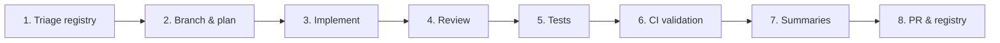

# AI Nutrition Assistant — Agent Workflow

How AI agents (and humans) ship the **`[AI Assistant]`** track on **`diego-torres/nutriconsultas`**. Separate from mobile API, subscription, and public booking — do not mix OpenAI orchestration into unrelated PRs.

**Registries**

| File | Purpose |
|------|---------|
| [`ISSUE-AI-ASSISTANT.md`](ISSUE-AI-ASSISTANT.md) | `[AI Assistant]` issues #360–#409, states, dependencies |
| [`docs/ai/AI-ASSISTANT-PLAN.md`](docs/ai/AI-ASSISTANT-PLAN.md) | Architecture, security, tools, milestones |
| [`ISSUE-NUTRITIONIST-WEB.md`](ISSUE-NUTRITIONIST-WEB.md) | Nutritionist web (draft acceptance may touch platillos/dietas) |
| [`AGENT-WORKFLOW.md`](AGENT-WORKFLOW.md) | Mobile API workflow (orthogonal) |

**Current next issue:** [#366 — Add OpenAI Java Client](https://github.com/diego-torres/nutriconsultas/issues/366) (`NEXT` in [`ISSUE-AI-ASSISTANT.md`](ISSUE-AI-ASSISTANT.md)). ~~#365~~ config: `com.nutriconsultas.ai.AiProperties`.

---

## Product context (read before every session)

| Topic | Guidance |
|-------|----------|
| **Language** | **Spanish (es-MX) only** for all AI assistant user-facing text — model output, UI, errors, drafts (#367, #399, #401). See track principles in [`ISSUE-AI-ASSISTANT.md`](ISSUE-AI-ASSISTANT.md). |
| **Audience** | **Licensed nutritionists** on `/admin/**` — not patients, not mobile API consumers in v1. |
| **API key** | `OPENAI_API_KEY` server-only (`OPEN_API_KEY` legacy alias may exist in `.env`). Never in browser, logs, or Git. |
| **Plan gating** | **Plus + Consultorio only** (#409) — new `AI_ASSISTANT` entitlement; `AI_ENABLED` does not bypass plan check |
| **Feature flag** | `AI_ENABLED=false` by default until release checklist (#408) passes. |
| **Drafts only** | AI creates `DRAFT` records; nutritionist must accept before real platillo/dieta/patient assignment. |
| **Multi-tenant** | All catalog and patient-context tools scoped to authenticated nutritionist / clinic — same rules as [`Paciente.userId`](src/main/java/com/nutriconsultas/paciente/Paciente.java). |
| **Privacy** | Minimum patient data to OpenAI; no names/emails/phones in prompts or unstructured logs; see [`DATA-ACCESS-RULES.md`](docs/ai/DATA-ACCESS-RULES.md) (#362). |
| **Schema gate** | #46 Liquibase baseline on `main`. All `ai_chat_*` tables → incremental changesets ([`docs/db/LIQUIBASE.md`](docs/db/LIQUIBASE.md)). |
| **Medical safety** | Assistant is a **drafting tool** — include assumptions, warnings, clarifying questions; never auto-assign diets. |

---

## Overview



Phases mirror [`AGENT-WORKFLOW.md`](AGENT-WORKFLOW.md).

---

## Phase 1 — Triage & registry sync

1. Pull latest on `main`.
2. Open [`ISSUE-AI-ASSISTANT.md`](ISSUE-AI-ASSISTANT.md) — find `NEXT`; confirm dependencies `done`.
3. Sync GitHub:
   ```bash
   gh issue view 361
   gh issue list --search "[AI Assistant] in:title" --state open
   ```
4. Read [`docs/ai/AI-ASSISTANT-PLAN.md`](docs/ai/AI-ASSISTANT-PLAN.md) for security and tool contracts before coding.

---

## Phase 2 — Branch & plan

- Branch: `issue-361-ai-functional-scope` (replace number/topic).
- One issue per PR when possible; epics are tracking-only.
- Phase 0 (#361–#363) is **docs-only** — output lands in `docs/ai/`.
- Phase 1+ requires tests per project rules.

---

## Phase 3 — Implement

### Package layout (suggested)

```text
com.nutriconsultas.ai/
  config/          — OpenAI properties, feature flag
  client/          — OpenAiClientService
  orchestration/   — chat + tool loop
  tools/           — catalog, nutrient, draft tools
  persistence/     — entities, repos, draft lifecycle
  web/             — AiChatController
  mcp/             — Phase 7 MCP dispatch
```

### Security checklist (every PR)

- [ ] User-facing AI copy is **Spanish (es-MX)** — assistant messages, UI, errors, draft labels
- [ ] No API key in frontend, templates, or responses
- [ ] Endpoints under authenticated nutritionist paths
- [ ] Tool handlers verify tenant ownership
- [ ] No direct patient diet assignment from AI tools
- [ ] Logs redact PHI and secrets

---

## Phase 4 — Review

- Confirm issue acceptance criteria in PR description.
- Link `Fixes #NNN` or `Refs #NNN` for doc-only work.
- Security-sensitive: MCP (#391–#395), orchestration (#385), data access doc (#362).

---

## Phase 5 — Tests

| Layer | Requirement |
|-------|-------------|
| Service | Mockito unit tests for tools, orchestration, draft lifecycle |
| Controller | `@SpringBootTest` + `@AutoConfigureMockMvc` for `/nutritionist/ai/**` |
| Liquibase | Migration test for `ai_chat_*` changesets |
| Templates | Update validators for chat UI (#388–#390) |
| Security | Cross-tenant access denied tests (#403, #395) |

Mock OpenAI in tests — never call live API in CI.

---

## Phase 6 — CI validation

```bash
mvn spring-javaformat:apply
./lint.sh
mvn test
```

---

## Phase 7 — PR & registry

1. Update [`ISSUE-AI-ASSISTANT.md`](ISSUE-AI-ASSISTANT.md): `in-progress` → `done` when merged.
2. Update epic row if all children complete.
3. For config/docs issues: update `.env.example` and `docs/ai/` in same PR.

---

## Milestone gates

| Gate | Required before |
|------|-----------------|
| M1 complete | Any live OpenAI call in staging |
| M2 complete | Orchestration tool loop (#385) |
| M3 complete | Nutritionist beta (`AI_ENABLED=true` staging) |
| M4 complete | External MCP clients |
| M5 + #408 | Production `AI_ENABLED=true` |

---

## Local & production config

| Variable | Purpose |
|----------|---------|
| `AI_ENABLED` | Feature flag |
| `OPENAI_API_KEY` / `OPEN_API_KEY` | Server secret |
| `OPENAI_MODEL` | e.g. `gpt-5.5` |
| `AI_MAX_TOOL_CALLS` | Orchestration limit (default 8) |

EC2: `/opt/nutriconsultas/app.env` — update via SSM (see #406).
