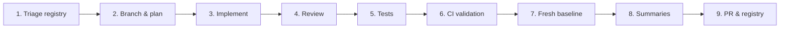

# Subscription Enforcement — Agent Workflow

How AI agents (and humans) ship the **`[Subscription]`** track on **`diego-torres/nutriconsultas`**. This is a **separate parallel track** from the patient mobile API — do not mix mobile endpoint work into subscription PRs.

**Why a separate workflow?** [`AGENT-WORKFLOW.md`](AGENT-WORKFLOW.md) is scoped to `/rest/mobile/patient/**` (JWT resource server, patient DTOs, IDOR by `patientAuthSub`). Subscription enforcement touches OAuth2 web sessions, platform admin config, payment webhooks, clinic hierarchy, and Thymeleaf admin UI — different security surface, dependencies, and reviewers.

**Registries**

| File | Purpose |
|------|---------|
| [`ISSUE-SUBSCRIPTION.md`](ISSUE-SUBSCRIPTION.md) | `[Subscription]` issues, states, dependencies |
| [`docs/subscription/SUBSCRIPTION-ENFORCEMENT-PLAN.md`](docs/subscription/SUBSCRIPTION-ENFORCEMENT-PLAN.md) | Canonical plan tiers, entitlements, lifecycle, data model |
| [`ISSUE.md`](ISSUE.md) | Mobile API track (orthogonal) |
| [`AGENT-WORKFLOW.md`](AGENT-WORKFLOW.md) | Mobile API workflow (orthogonal) |

**Current next issue:** See [`ISSUE-SUBSCRIPTION.md`](ISSUE-SUBSCRIPTION.md) row marked `NEXT`.

---

## Product context (read before every session)

| Topic | Guidance |
|-------|----------|
| **Audience** | **Nutritionist web app** (`/admin/**`) and platform admin surfaces — not patient mobile API. |
| **Platform admin** | Only users in `nutriconsultas.platform.admin-user-ids` or `admin-emails` (`PlatformAdminService`). Never infer admin from Auth0 groups alone. |
| **Roles** | `nutriologo-basico`, `nutriologo-profesional`, `nutriologo-plus`, `director-consultorio` — assigned by admins (or inherited via clinic invite). |
| **Billing** | Monthly subscription; admin `paymentExempt` for trials/extensions; grace period after expiry. |
| **Clinic model** | `director-consultorio` owns a `Clinic`; invites nutritionists without separate payment; can suspend members. |
| **Enforcement** | Central `SubscriptionEntitlementService` — patient/nutritionist limits, report tiers, PDF export. |
| **Schema gate** | **#46 Liquibase baseline first**, then subscription entities. Do not rely on `ddl-auto=update` for production. |
| **PHI** | Never log patient names in subscription/billing logs; audit events use user IDs only. |

---

## Overview



Phases mirror [`AGENT-WORKFLOW.md`](AGENT-WORKFLOW.md) but context sources differ (see Phase 2).

---

## Phase 1 — Triage & registry sync

1. **Pull latest** on `main`.
2. **Open** [`ISSUE-SUBSCRIPTION.md`](ISSUE-SUBSCRIPTION.md) — find `NEXT`; confirm dependencies `done`.
3. **Sync GitHub:**
   ```bash
   gh issue view <number>
   gh issue list --search "[Subscription] in:title" --state open
   ```
4. **Gates:**
   - **#46 Liquibase** must be `done` before schema issues (#163+).
   - **#163** (plan catalog + schema) blocks all enforcement issues.
   - **#164** (entitlement service) blocks limit and report gating.
   - Payment provider choice blocks #166 webhook work — document in plan if TBD.
5. Update local registry when GitHub drifts.

**Exit criteria:** One `NEXT` issue, dependencies satisfied, registries aligned.

---

## Phase 2 — Branch, context, and plan

1. **Branch naming:** `subscription/<number>-<short-slug>` (e.g. `subscription/163-plan-catalog-schema`).
2. **Context sources:**

   | Source | What to extract |
   |--------|-----------------|
   | Issue body | Acceptance criteria |
   | [`SUBSCRIPTION-ENFORCEMENT-PLAN.md`](docs/subscription/SUBSCRIPTION-ENFORCEMENT-PLAN.md) | Entitlements table, state machine, invitation flows |
   | `PlatformAdminService` | Existing admin detection |
   | `eterna/index.html` pricing table | Marketing ↔ `PlanTier` mapping |
   | `PatientReportRestController` | PDF endpoints to gate |
   | `SecurityConfig.java` | Web OAuth2 chain (not mobile chain) |

3. **Plan must include:** entities/migrations, services, admin UI routes, Auth0 sync touchpoints, webhook security, test matrix, explicit out-of-scope.

**Do not implement until the plan is acknowledged.**

---

## Phase 3 — Implement

**Rules**

- One issue per PR; no mobile API drive-by changes.
- **Liquibase:** incremental changesets for all schema (#46+). When `@Entity` or catalog data changes, follow [`docs/db/LIQUIBASE.md`](docs/db/LIQUIBASE.md) and the Liquibase section in [`AGENT-WORKFLOW.md`](AGENT-WORKFLOW.md) — same PR as entity edits; no `ddl-auto=update`.
- Enforce entitlements in **service layer** (controllers thin).
- Director flows never expose platform admin capabilities.
- Payment webhooks: idempotent, signature-verified, no PHI in payload logs.
- Reuse invitation token patterns from mobile onboarding research (#133) — separate entities for nutritionist vs patient invites.

**Exit criteria:** Acceptance criteria met; entitlement checks wired for in-scope surfaces.

---

## Phase 4 — Review

- Platform admin routes guarded by `PlatformAdminService`.
- Director routes scoped to owned `Clinic`.
- Grace / suspended states behave per plan doc.
- No cross-clinic data leakage (multi-tenant by `userId` / `clinicId`).
- Adversarial: non-admin cannot assign `nutriologo-plus`; director cannot exceed `maxNutritionists`.

---

## Phase 5 — Testing

| Layer | Tool | Focus |
|-------|------|-------|
| Entitlement service | JUnit + Mockito | All `PlanTier` × `Entitlement` matrix |
| State machine | Unit | ACTIVE→GRACE→SUSPENDED transitions |
| Admin controller | `@WebMvcTest` + `@WithMockUser` | 403 for non-admin |
| Webhook | `@SpringBootTest` | Idempotency, invalid signature → 400 |
| Limits | Integration | Create patient blocked at cap |

```bash
./lint.sh && bash scripts/audit-logging.sh && mvn -B verify
```

---

## Phase 6 — CI validation

Same as [`AGENT-WORKFLOW.md`](AGENT-WORKFLOW.md) Phase 6 — full `mvn verify` with `-Pci` parity.

---

## Phase 7 — Fresh baseline

Before commit:

1. `git fetch origin && git rebase origin/main`
2. Re-run verify.
3. Update [`ISSUE-SUBSCRIPTION.md`](ISSUE-SUBSCRIPTION.md) in the PR.
4. If cross-track dependency changes (e.g. #46 merged), update mobile [`ISSUE.md`](ISSUE.md) only if explicitly coupled.

---

## Phase 8 — Summaries

Same ELI5 + technical format as mobile workflow. Example:

> **ELI5 (#170):** The app now counts how many patients you have and stops you from adding more if your plan is full — like a parking lot with a maximum number of spaces.
>
> **Technical:** `SubscriptionEntitlementService.assertCanCreatePatient(userId)` called from `PacienteService.save`; `PlanTier.BASICO` cap 10; returns 403 `error.subscription.patient_limit`.

---

## Phase 9 — Commit, PR, registry

```bash
git checkout -b subscription/163-plan-catalog-schema
# ... work ...
git commit -m "feat(subscription): plan catalog and subscription schema (#163)"
gh pr create --title "feat(subscription): plan catalog and subscription schema (#163)" ...
```

Update [`ISSUE-SUBSCRIPTION.md`](ISSUE-SUBSCRIPTION.md) in the same PR.

---

## Cross-track coordination

| Track | Interaction |
|-------|-------------|
| `[Mobile API]` #132–#141 | Patient invitations — **different** entities; share token-hashing utilities only |
| #46 Liquibase | Subscription migrations are changesets **after** baseline |
| #108 Auth0 tenant | Extend for nutritionist role groups / Management API |
| `Paciente.userId` | Unchanged — still nutritionist tenant key |

When both tracks touch `SecurityConfig`, coordinate in separate PRs or a thin integration PR with both leads reviewing.

---

## Quick reference

```bash
git fetch origin && git checkout main && git pull origin main
gh issue list --search "[Subscription] in:title" --state open
cat ISSUE-SUBSCRIPTION.md
cat docs/subscription/SUBSCRIPTION-ENFORCEMENT-PLAN.md
```

---

## Current sprint pointer

| Field | Value |
|-------|-------|
| **Next issue** | [#181 — SubscriptionEntitlementService](https://github.com/diego-torres/nutriconsultas/issues/181) |
| **Status** | **in-progress** on `subscription/181-entitlement-service` |
| **Early start** | [#183 — Platform admin RBAC](https://github.com/diego-torres/nutriconsultas/issues/183) (no schema) |

See [`ISSUE-SUBSCRIPTION.md`](ISSUE-SUBSCRIPTION.md) for full registry.
