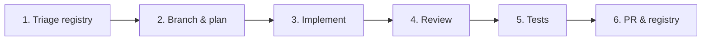

# Support tickets — Agent Workflow

How AI agents (and humans) ship the **`[Support]`** track on **`diego-torres/nutriconsultas`**. Separate from mobile API, subscription, AI assistant, and public booking — do not mix support-ticket schema/UI into unrelated PRs unless explicitly coupled (e.g. shared topbar fragment).

**Registries**

| File | Purpose |
|------|---------|
| [`ISSUE-SUPPORT.md`](ISSUE-SUPPORT.md) | `[Support]` issues #540–#548, states, dependencies |
| [`docs/support/SUPPORT-TICKETS-PLAN.md`](docs/support/SUPPORT-TICKETS-PLAN.md) | Product/tech plan, data model, version bump |
| [`AGENT-WORKFLOW.md`](AGENT-WORKFLOW.md) | Mobile API workflow (orthogonal) |

**Current next issue:** [#544](https://github.com/diego-torres/nutriconsultas/issues/544) — Support ticket service. ~~#543~~ schema **done**. ~~#548~~ docs **done**.

---

## Recommended delivery sequence

| Wave | Issues | Outcome |
|------|--------|---------|
| **A — Docs** | **#548** | Registry, plan, workflow, README/AGENTS pointers |
| **B — Schema** | **#543** | Liquibase table + JPA entity + repository |
| **C — Domain** | **#544** | Service: create, list own, admin list/filter/update/close |
| **D — Shell** | **#541**, **#542** | Topbar menu + Acerca de version modal (parallel OK) |
| **E — UI** | **#545** → **#546** | Nutritionist page, then platform admin inbox |
| **F — Quality** | **#547** | Remaining tests/validators (also ship with each PR) |

---

## Product context (read before every session)

| Topic | Guidance |
|-------|----------|
| **Language** | User-facing copy **Spanish (es-MX)** — menu, forms, swal dialogs, empty states |
| **Audience** | Nutritionists on `/admin/**` + platform admins; not patients / mobile API |
| **Admin gate** | `PlatformAdminService` / `requirePlatformAdmin` — same family as contact inquiries |
| **Ownership** | Nutritionist tickets scoped by Auth0 `sub` (`userId`); prefer 404 on miss |
| **Subscription column** | Resolve at read time from creator’s clinic/subscription — do not denormalize in v1 |
| **ContactInquiry** | Do **not** reuse for authenticated Soporte — separate product surface |
| **Dialogs** | bootstrap-sweetalert only — no native `alert`/`confirm` |
| **Schema gate** | Incremental Liquibase only ([`docs/db/LIQUIBASE.md`](docs/db/LIQUIBASE.md)) |
| **Version** | Maven `pom.xml` `<version>` → filtered `app.version` (or equivalent) → Acerca de; document bumps in README |
| **Privacy** | Log ticket ids only; no names/emails in unstructured logs |

---

## Overview

---

## Phase checklist (per issue)

1. **Triage:** `gh issue view <n>`; confirm dependencies in [`ISSUE-SUPPORT.md`](ISSUE-SUPPORT.md) are `done`.
2. **Branch:** `issue-<n>-short-slug` from latest `main`.
3. **Implement:** Follow [`docs/support/SUPPORT-TICKETS-PLAN.md`](docs/support/SUPPORT-TICKETS-PLAN.md); schema changes need Liquibase.
4. **Tests:** Service + controller tests; template validators for new Thymeleaf.
5. **Lint:** `mvn spring-javaformat:apply` and project lint/test gates before PR.
6. **Registry:** Set issue to `in-progress` / `done` in [`ISSUE-SUPPORT.md`](ISSUE-SUPPORT.md); update **NEXT**.
7. **PR:** Link `Fixes #<n>`; mention epic #540.

---

## Definition of done (track)

See epic [#540](https://github.com/diego-torres/nutriconsultas/issues/540) and plan DoD. Close #540 only when #541–#547 are `done` (and #548 docs merged).
