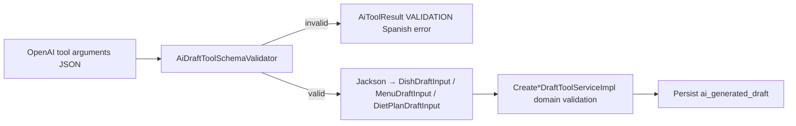

# Draft tool JSON schema validation (#402)

**Issue:** [#402](https://github.com/diego-torres/nutriconsultas/issues/402) · Epic [#400](https://github.com/diego-torres/nutriconsultas/issues/400)  
**Related:** [`TOOL-CONTRACT.md`](TOOL-CONTRACT.md) (#363) · [`NUTRITION-GOLDEN-PROMPTS.md`](NUTRITION-GOLDEN-PROMPTS.md) (#401)

Structured output validation for OpenAI draft tool arguments **before** Jackson deserialization and domain validation in `Create*DraftToolServiceImpl`.

---

## Schema location

| Resource | Purpose |
|----------|---------|
| `src/main/resources/ai/schemas/draft-tool-input-schemas.json` | Canonical JSON Schema definitions |
| `AiDraftToolSchemaValidator` | Validates tool `arguments` JSON at dispatch time |

Definitions (aligned with `TOOL-CONTRACT.md`):

| Schema key | Tool |
|------------|------|
| `DishDraftInput` | `create_dish_draft` |
| `MenuDraftInput` | `create_menu_draft` |
| `DietPlanDraftInput` | `create_diet_plan_draft` |

Shared types: `RecipeIngredientInput`, `IngestaSlot`, `IngestaSlotItem`, `NutrientSummary`, `DietPlanDayInput`.

---

## Validation pipeline



1. **Schema validation (#402)** — structure, required fields, `additionalProperties: false`, array bounds.
2. **Domain validation (#379–#381)** — business rules (name length, duplicate days, catalog lookups).

Schema failures return Spanish messages such as:

- *Argumentos de herramienta no válidos: JSON mal formado.*
- *Argumentos de herramienta no válidos: falta el campo obligatorio (ingredients).*
- *Argumentos de herramienta no válidos: campo no permitido (unexpectedField).*

The model receives these via the tool result envelope; the nutritionist sees the assistant explain the issue in Spanish (#399 follow-up).

---

## Tests

| Class | Coverage |
|-------|----------|
| `AiDraftToolSchemaValidatorTest` | Valid/invalid JSON, missing required fields, extra properties |
| `AiOrchestrationToolDispatcherTest` | Schema rejection before draft service invocation |

Run:

```bash
mvn test -Dtest=AiDraftToolSchemaValidatorTest,AiOrchestrationToolDispatcherTest
```

---

## Manual verification

In `/admin/ai` with `AI_ENABLED=true`, tool audit rows for rejected drafts should show `"success": false` with `errorCode: "VALIDATION"` before any `ai_generated_draft` row is created.
