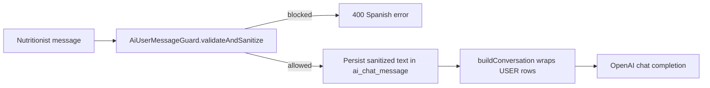

# AI Prompt Security (v1)

**Issue:** [#439](https://github.com/diego-torres/nutriconsultas/issues/439) · Epic [#438](https://github.com/diego-torres/nutriconsultas/issues/438)  
**Related:** [`DATA-ACCESS-RULES.md`](DATA-ACCESS-RULES.md) (#362) · [`AI-ASSISTANT-PLAN.md`](AI-ASSISTANT-PLAN.md)

Defense-in-depth rules for nutritionist chat input before OpenAI orchestration (#385). Part of Milestone 5 — required before production `AI_ENABLED=true` (see #408).

---

## Goals

| Goal | Implementation |
|------|----------------|
| Limit untrusted input size | `nutriconsultas.ai.max-user-message-length` (default **4000**, matches UI `maxlength`) |
| Detect high-risk override patterns | `AiUserMessageGuard` regex scan (English + Spanish fixtures) |
| Separate user content from system instructions | Delimiter wrap `<mensaje_nutriologo>…</mensaje_nutriologo>` on outbound user role messages |
| Model-side refusal | `ai/system-prompt-base.txt` **SEGURIDAD DE PROMPTS** section (#367) |
| User-facing block message | Spanish `400` via `AiChatException` — no OpenAI call, no persistence on block |

---

## Input pipeline



**Edit/resubmit (#437):** validation runs **before** thread truncation so a blocked edit cannot delete history.

**Storage vs model payload:** the database stores the sanitized plain text the nutritionist typed (after trim/control-char cleanup). Only the OpenAI request wraps user rows with delimiters.

---

## Blocked patterns (deterministic)

`AiUserMessageGuard` rejects messages matching known injection / jailbreak phrases, including:

- English: `ignore previous instructions`, `disregard prior instructions`, `forget your instructions`, `you are now a…`, `act as DAN`, `new instructions:`, `override system prompt`, `` ```system ``, `<|im_start|>system`, `[INST]`, `developer mode on`, `pretend you are not…`, `role: system`
- Spanish: `ignora las instrucciones anteriores`, `olvida tus instrucciones`

**Not blocked:** legitimate nutrition wording (e.g. “ignorar lácteos”, “sin instrucciones de cocina”) when it does not match the override regexes.

---

## Configuration

| Property | Env | Default |
|----------|-----|---------|
| `nutriconsultas.ai.max-user-message-length` | `AI_MAX_USER_MESSAGE_LENGTH` | `4000` (clamped 500–8000) |

---

## Error copy (Spanish)

| Case | Message |
|------|---------|
| Injection / jailbreak | *No puedo procesar este mensaje porque parece contener instrucciones para alterar el comportamiento del asistente…* |
| Length | *El mensaje supera el límite de N caracteres.* |
| Empty | *El mensaje no puede estar vacío.* |

HTTP status: **400** (`AiToolErrorCode.VALIDATION`) for chat REST and SSE error events.

---

## Testing

- **Unit:** `AiUserMessageGuardTest` — fixtures only, no live OpenAI
- **Integration:** `AiOrchestrationServiceTest` — wrapped user content in completion request
- **Future:** #450 golden prompts for bulk/abuse scenarios; #448 LLM scope classifier

---

## Follow-up issues

| # | Topic |
|---|--------|
| **440** | Jailbreak / role-override refusal corpus (model behavior) |
| **441** | Delimiters, tool allowlist, output validation (defense-in-depth) |
| **447** | Deterministic bulk scope limits (Java pre-check) |
| **448** | LLM scope classifier pre-flight |

---

## Logging

- Do **not** log full user message bodies when blocking — log thread id + block reason category only if needed (#397 audit).
- Never log patient-identifiable data in guard failures.
