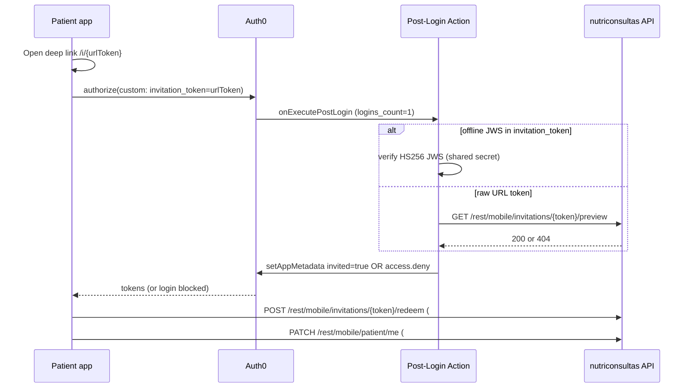

# Auth0 Post-Login Action — patient invitation gate (#140)

Invite-only patient onboarding requires a valid invitation on **first login**. Social connections (Google, Apple) skip Auth0 **Pre-User-Registration**, so the gate **must** be a **Post-Login Action**.

**Canonical contract:** [`docs/mobile-api/ALIGNMENT-SPEC.md`](../mobile-api/ALIGNMENT-SPEC.md) §F8.6.2.

---

## Why Post-Login (not Pre-User-Registration)

| Trigger | Google / Apple social | Username-Password |
|---------|----------------------|-------------------|
| Pre-User-Registration | Does **not** run | Runs |
| Post-Login | Runs | Runs |

A Pre-User-Registration Action would **not** protect social sign-up paths.

---

## End-to-end flow



1. Nutritionist creates invite (#134) → deep link with **raw URL token** (43-char base64url).
2. Patient app stores token from deep link.
3. On Auth0 `authorize`, pass custom query param **`invitation_token`** (see [mobile #64](https://github.com/Escanor4323/nutriconsultas-mobile/issues/64)).
4. Post-Login Action validates on `logins_count === 1`, stamps `app_metadata.invited = true` on success.
5. Backend **redeem** (#136) and **onboarding gate** (#137) remain authoritative regardless of Auth0 outcome.

---

## Action script

Source: [`docs/auth0/actions/patient-invitation-gate.js`](actions/patient-invitation-gate.js)

### Logic summary

| Condition | Behavior |
|-----------|----------|
| `app_metadata.invited === true` | Allow (skip gate) |
| `logins_count !== 1` | Allow (legacy / returning users; not first login) |
| `logins_count === 1` | Require valid `invitation_token` |
| Valid token | `api.user.setAppMetadata('invited', true)` |
| Invalid / missing token | `api.access.deny('invitation_required', …)` |

### Validation modes (either/or)

| Mode | When | How |
|------|------|-----|
| **Offline JWS** | `invitation_token` matches compact JWS shape **and** `PATIENT_INVITATION_JWS_SECRET` is set | HS256 verify; payload `patientId`, `tokenHash`, `exp` per §F8.6.2 |
| **Preview API** | Raw URL token (default mobile path) **and** `API_BASE_URL` secret set | `GET {API_BASE_URL}/rest/mobile/invitations/{token}/preview` → HTTP 200 |

**Recommendation:** configure **both** secrets in production. Mobile passes the **raw URL token** from the deep link; preview catches revocation/expiry. Nutritionist tooling may pass **offline JWS** from create response when testing without API round-trip.

Offline JWS does **not** replace DB redeem (#136) for single-use enforcement.

---

## Deployment checklist

### 1. Backend secrets (already on app host)

| Env var | Purpose |
|---------|---------|
| `PATIENT_INVITATION_JWS_SECRET` | Same value as Auth0 Action secret; enables `offlineJws` on create (#134) |
| `PATIENT_INVITATION_BASE_URL` | Deep link host (e.g. `https://minutriporcion.com`) |

### 2. Auth0 Action secrets

In Dashboard → Actions → *patient-invitation-gate* → Settings → Secrets:

| Secret name | Example | Required |
|-------------|---------|----------|
| `PATIENT_INVITATION_JWS_SECRET` | (same as backend) | Optional; required for JWS path |
| `API_BASE_URL` | `https://minutriporcion.com` | **Required** for raw-token mobile path |

### 3. Create and attach Action

1. Auth0 Dashboard → **Actions** → **Library** → **Build Custom** → **Post Login**.
2. Name: `patient-invitation-gate`.
3. Paste [`patient-invitation-gate.js`](actions/patient-invitation-gate.js).
4. Add secrets above.
5. **Deploy**.
6. **Actions** → **Flows** → **Login** → drag action into flow → **Apply**.

### 4. Mobile app (`invitation_token` custom param)

Pass on Auth0 authorize (social / legacy Universal Login) **or** on Authentication API `login` parameters (in-app email/password):

```javascript
await authorize({
  scope: 'openid profile email offline_access',
  audience: 'https://api.nutriconsultas.minutriporcion.com',
  additionalParameters: {
    invitation_token: storedUrlTokenFromDeepLink,
  },
});
```

```dart
// In-app database signup/login (auth0_flutter Authentication API)
await auth0.api.login(
  usernameOrEmail: email,
  password: password,
  connectionOrRealm: 'Username-Password-Authentication',
  audience: apiAudience,
  parameters: {'invitation_token': humanCodeOrUrlToken},
);
```

Auth0 forwards custom authorize params to `event.request.query` in Post-Login Actions. Password-grant `login` parameters appear in `event.request.body` — the gate script reads both.

### 5. Disable public signup (nutritionist web)

See [`docs/subscription/AUTH0-ROLE-SYNC.md`](../subscription/AUTH0-ROLE-SYNC.md) — patient native app uses social + invitation gate; nutritionist signup remains invitation-based separately.

---

## Denied social users — cleanup strategy (Option B)

**Decision (2026-06-22, #140):** **Option B — leave blocked & harmless.**

| Option | Description | Chosen |
|--------|-------------|--------|
| A | Scheduled Management API job deletes users where `invited != true` and `logins_count <= 1` | No |
| B | Orphan Auth0 users remain; backend gates are authoritative | **Yes** |

**Rationale:**

- Denied first login still **creates** the Auth0 user (social providers). A second login attempt has `logins_count > 1` and **passes** this Action (only first login is gated).
- Those users **cannot redeem** (#136) without a valid token and **cannot access patient APIs** (#137: 403 onboarding required).
- No PHI is exposed; no Management API cron or delete permissions required.
- Optional future hardening: Pre-Login Action or Option A job — track separately if tenant hygiene becomes a concern.

---

## Secret rotation

Rotating `PATIENT_INVITATION_JWS_SECRET` invalidates outstanding **offline JWS** tokens only. DB-backed invitations and raw URL tokens remain valid until expiry/revoke. Re-issue invites or rely on preview path after rotation.

---

## Logging policy (#141)

- **Never** log `invitation_token`, raw URL tokens, human codes, or offline JWS in Action code, custom log streams, or `console.*`.
- The Action does not emit token values; rely on deny/allow outcomes only.
- Preview API fallback passes the token in the request URL — restrict Auth0 platform log access and retention.

---

## Testing

### Local JWS interop (Java ↔ Action script)

```bash
mvn test -Dtest=PatientInvitationGateScriptInteropTest
```

Runs `scripts/test-patient-invitation-gate.cjs` against JWS tokens signed by `PatientInvitationJws` (Java).

### Manual Auth0 test

1. Create invite via nutritionist JWT (`POST /rest/mobile/invitations`).
2. Copy URL token from `inviteUrl`.
3. Auth0 authorize with `invitation_token` = URL token.
4. First login → success, `app_metadata.invited: true` in user profile.
5. Repeat without token → `access.denied` on first login.

### E2E status doc

Update [`docs/mobile-api/MOBILE-E2E-STATUS.md`](../mobile-api/MOBILE-E2E-STATUS.md) after tenant deployment.

---

## Related issues

| # | Topic |
|---|-------|
| 133 | Offline JWS signing (Java) |
| 135 | Preview endpoint (Action fallback validation) |
| 136 | Redeem gate (authoritative) |
| 137 | Onboarding API gate |
| 141 | Rate limits, enumeration hardening |
