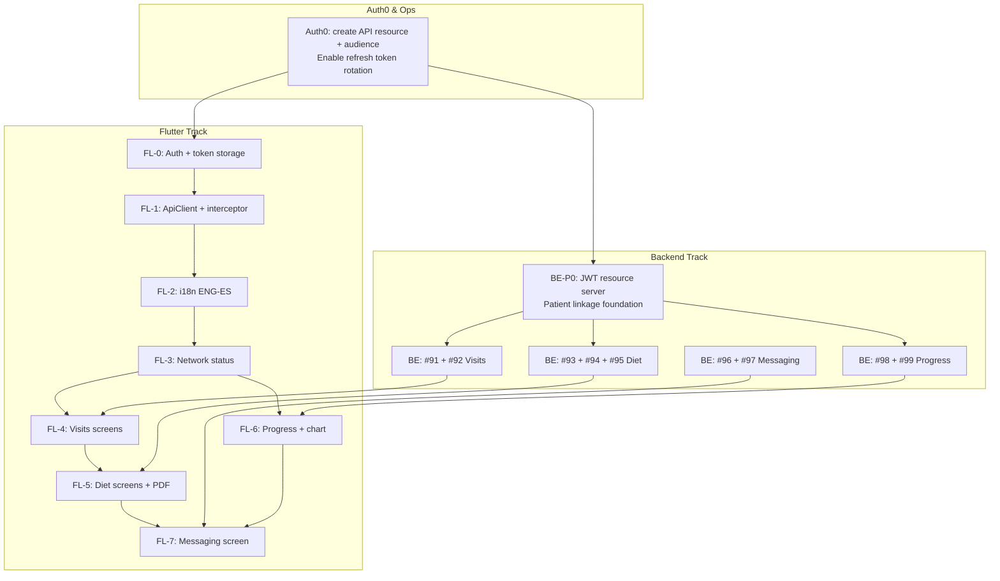

# Mobile API — Token Auth & Endpoint Roadmap (v2)

**Date:** 2026-06-09 (revised)
**Repo:** nutriconsultas (Minutriporcion)
**Epic:** Patient mobile REST API under `/rest/mobile/patient/**`
**Open issues:** [#91](https://github.com/diego-torres/nutriconsultas/issues/91) – [#99](https://github.com/diego-torres/nutriconsultas/issues/99) (9 endpoints)
**Flutter app:** GetX state/DI/routing, `flutter_screenutil`, teal/orange palette, locale ENG-ES

---

## Reality reconciliation (2026-06-09)

> **Audience reconciliation (2026-06-09):** app is PATIENT-FACING; nutritionist scaffold (patients/consultations/meal_plans CRUD, roster nav, create-patient FAB) is being retired — see tracking issues created 2026-06-09 in `Escanor4323/nutriconsultas-mobile`.

> **State verification (2026-06-11):**
>
> - **Backend schema (2026-06-14):** Phase 0 **done** (#107 PR #117, #109 PR #142, #110). **Endpoints on `main`:** #91–#98 (visits, diet + PDF, messages, progress snapshot). **#96/#97** messaging (`PatientMessage` entity, POST returns **201**, Resilience4j **10/min** per `patientAuthSub` — #113, PR #151). **#111** localized `ApiResponse` errors (403/404/400/429). **#99 progress measurements in progress.** #116 optional `senderDisplayName`; #106 dashboard IMC gauge **done**.
> - **DTO field-name map (authoritative — ALIGNMENT-SPEC §F8):** `Dieta.nombre→dietaName`, `energia→totalKcal`, `proteina→totalProteina`, `lipidos→totalGrasas`, `hidratosDeCarbono→totalCarbohidratos`; `Ingesta.nombre→tipo`; `PlatilloIngesta.name/portions/energia→nombre/porciones/kcal`, `hidratosDeCarbono→carbohidratos`, `lipidos→grasas` (same for `AlimentoIngesta`). Enums: `EventStatus = SCHEDULED/COMPLETED/CANCELLED`; `PacienteDietaStatus = ACTIVE/COMPLETED/CANCELLED` (no INACTIVE); `NivelPeso = BAJO/NORMAL/ALTO/SOBREPESO` (translate to `imcLabel` server-side). `deltaPeso`/`deltaImc` are computed, not stored.
> - **Mobile redesign branch state (style/editorial-redesign):** Auth dedup complete — `AuthFlowController` + login/signup/welcome screens canonical; PR #48's `AuthController`/`LoginView` retired (commit 3427612); `flutter analyze` clean, 146/146 tests pass. Canonical design source: `.claude/MiNutriporcion-2/` (light editorial palette; dark welcome/login PNGs are OLD, ignore). Mobile issues #13/#21/#31 done; #32/#33 in flight on branch.

> Verified against both repos and live pubspec. This roadmap was drafted before a full codebase audit; the following deviations from the original text were found and corrected throughout:
>
> 1. **Networking: Dio, not GetConnect.** `pubspec.yaml` has `dio: ^5.7.0`; there is no GetConnect usage. All interceptor code in §A3/§A6/§G-pubspec and FL-1 has been rewritten to Dio.
> 2. **Project structure: feature-first GetX, not clean-arch.** The actual `lib/` uses `core/{constants,utils,models,services}`, `app/{theme,bindings,controllers,routes,translations}`, and `shared/{layouts,widgets}`. The `domain/{entities,usecases,repositories}` clean-arch layer shown in §A1 is the outlier — it has been replaced with the actual + target feature-first layout (adding `core/{network,auth,exceptions,di}`, `data/`, and `features/<f>/` incrementally).
> 3. **21 mobile issues already exist** in `Escanor4323/nutriconsultas-mobile` (#1–#21). The FL-0…FL-9 issues in Part D are mapped to these existing issues; see the reconciliation table in §Part D.
> 4. **i18n translations already exist** at `lib/app/translations/{app_translations.dart, locales/es_MX.dart, locales/en_US.dart}`. FL-2 is largely done; remaining work is locale-toggle persistence and the `Accept-Language` header on Dio.
> 5. **Patient sub mapping:** The Auth0 `sub` claim for a patient maps to `Paciente.patientAuthSub` (a new field). `Paciente.userId` is the nutritionist's sub — do not use it for patient JWT resolution.

---

## Executive summary

The original plan covered the Spring Boot backend correctly but was **missing the entire Flutter client architecture** and contained a **critical Auth0 misconfiguration** that would cause JWT validation to silently fail for all mobile users.

Three hard blockers before any feature issue can ship:

1. **Auth0 API audience not configured** — A Flutter Native Application in Auth0 returns an **opaque encrypted token** (`"alg":"dir"`), not a JWT. Spring Boot's resource server cannot validate it. You must create a separate Auth0 **API** resource and pass its audience in the Flutter auth request.
2. **No JWT resource server on the backend** — Spring Boot only has `oauth2Login` (session cookies for nutritionists). Mobile routes need a dedicated `SecurityFilterChain`.
3. **No Flutter auth/API layer** — No `AuthController`, no `ApiClient`, no token storage, no interceptor, no i18n-aware request headers.

**Recommendation:** Run two parallel tracks (Flutter foundation + Backend foundation) before any feature vertical.

---

## Part A — Flutter Architecture

### A1 — Correct GetX project structure for this app

The live code uses a **feature-first GetX** layout (not clean-arch). The tree below reflects the current `lib/` plus the target additions being introduced incrementally (marked ★):

```
lib/
├── main.dart
├── app/
│   ├── bindings/            # Global/root GetX Bindings
│   ├── controllers/         # App-wide controllers (e.g. locale)
│   ├── routes/              # GetPage definitions + route guards
│   ├── theme/               # ThemeData, colors, text styles
│   └── translations/        # app_translations.dart, locales/es_MX.dart, locales/en_US.dart
├── core/
│   ├── constants/           # API base URL constants, env config
│   ├── models/              # Shared data models (existing)
│   ├── services/            # auth_service, api_service, notification_service, storage_service
│   ├── utils/               # log_redactor.dart, date helpers
│   ├── auth/                # ★ auth_service.dart (Auth0), auth_middleware.dart
│   ├── network/             # ★ api_client.dart (Dio), auth_interceptor.dart, error_interceptor.dart, network_status.dart
│   ├── exceptions/          # ★ app_exception.dart (sealed: NetworkError, Unauthorized, etc.)
│   └── di/                  # ★ dependencies.dart (Get.lazyPut initial bindings)
├── shared/
│   ├── layouts/             # Shared layout widgets
│   └── widgets/             # Reusable UI components (component lib — issue #21)
├── data/                    # ★ Introduced per feature vertical
│   ├── models/              # JSON-serializable DTOs (json_serializable)
│   └── repositories/        # Concrete repo implementations (one per domain)
└── features/
    └── <feature>/           # auth, home, visits, diet, messages, progress
        ├── bindings/
        ├── controllers/
        ├── views/
        └── widgets/
```

> **Note:** The `domain/{entities,usecases,repositories}` clean-arch layer shown in earlier drafts is **not used** — drop it. There is no `presentation/` top-level folder; controllers live inside each `features/<f>/` subtree.

### A2 — Auth0 Flutter SDK (auth0_flutter) — PKCE flow

Use the **official `auth0_flutter`** package (not `flutter_appauth` directly). It wraps AppAuth with PKCE, handles the redirect callback, and provides `CredentialsManager` for silent token refresh.

**Critical configuration — must pass `audience`:**

```dart
// core/auth/auth_controller.dart
final _auth0 = Auth0('YOUR_DOMAIN.auth0.com', 'YOUR_NATIVE_CLIENT_ID');

Future<void> login() async {
  final credentials = await _auth0.webAuthentication(scheme: 'com.minutriporcion').login(
    audience: 'https://api.nutriconsultas.minutriporcion.com',  // Auth0 API identifier
    scopes: {'openid', 'profile', 'email', 'offline_access'},
  );
  await _storage.saveCredentials(credentials);
  _isAuthenticated.value = true;
}

// Silent refresh — called by interceptor before each request
Future<String> getValidAccessToken() async {
  final credentials = await _auth0.credentialsManager.credentials();
  return credentials.accessToken;  // CredentialsManager auto-refreshes if expired
}
```

**Why this matters:** Without the `audience` parameter, Auth0 returns an **opaque token** (`alg: dir`) that Spring Boot cannot parse. Passing the API identifier forces Auth0 to issue a signed JWT that the resource server can validate with JWKS.

### A3 — Dio interceptors (AuthInterceptor + ErrorInterceptor)

The networking stack is **Dio** (`dio: ^5.7.0`), not GetConnect. Two interceptors are chained on the shared `Dio` instance:

```dart
// core/network/api_client.dart
class ApiClient {
  late final Dio _dio;

  ApiClient({required AuthService authService}) {
    _dio = Dio(BaseOptions(
      baseUrl: const String.fromEnvironment('API_BASE_URL'),
      connectTimeout: const Duration(seconds: 10),
      receiveTimeout: const Duration(seconds: 20),
    ));
    _dio.interceptors.addAll([
      AuthInterceptor(authService),
      ErrorInterceptor(),
    ]);
  }

  Future<Response> get(String path, {Map<String, dynamic>? params}) =>
      _dio.get(path, queryParameters: params);

  Future<Response<List<int>>> getBytes(String path) =>
      _dio.get(path, options: Options(responseType: ResponseType.bytes));

  Future<Response> post(String path, {Object? data}) =>
      _dio.post(path, data: data);
}

// core/network/auth_interceptor.dart
class AuthInterceptor extends Interceptor {
  final AuthService _auth;
  AuthInterceptor(this._auth);

  @override
  Future<void> onRequest(
      RequestOptions options, RequestInterceptorHandler handler) async {
    final token = await _auth.getValidAccessToken(); // CredentialsManager auto-refreshes
    options.headers['Authorization'] = 'Bearer $token';
    options.headers['Accept-Language'] = Get.locale?.toLanguageTag() ?? 'es-MX';
    handler.next(options);
  }

  @override
  Future<void> onError(DioException err, ErrorInterceptorHandler handler) async {
    if (err.response?.statusCode == 401) {
      await _auth.logout();
      Get.offAllNamed(Routes.LOGIN);
    }
    handler.next(err);
  }
}

// core/network/error_interceptor.dart
class ErrorInterceptor extends Interceptor {
  @override
  void onError(DioException err, ErrorInterceptorHandler handler) {
    final AppException appEx = switch (err.response?.statusCode) {
      401 => const AppException.unauthorized(),
      403 => const AppException.forbidden(),
      404 => const AppException.notFound(),
      400 => AppException.validation(err.response?.data),
      _ when err.type == DioExceptionType.connectionTimeout ||
             err.type == DioExceptionType.receiveTimeout =>
             const AppException.networkError(),
      _ => const AppException.serverError(),
    };
    handler.reject(DioException(requestOptions: err.requestOptions, error: appEx));
  }
}
```

**Note on concurrent refresh:** `CredentialsManager` (from `auth0_flutter`) guards re-entrant refresh internally. The `AuthInterceptor` delegates to it via `AuthService.getValidAccessToken()`, so no additional mutex is needed at the interceptor level.

### A4 — flutter_secure_storage wrapper

```dart
// core/auth/credentials_storage.dart
class CredentialsStorage {
  static const _storage = FlutterSecureStorage(
    aOptions: AndroidOptions(encryptedSharedPreferences: true),
    iOptions: IOSOptions(accessibility: KeychainAccessibility.first_unlock),
  );

  static const _credKey = 'auth0_credentials';

  Future<void> saveCredentials(Credentials c) async =>
      _storage.write(key: _credKey, value: jsonEncode(c.toMap()));

  Future<Credentials?> readCredentials() async {
    final raw = await _storage.read(key: _credKey);
    return raw != null ? Credentials.fromMap(jsonDecode(raw)) : null;
  }

  Future<void> clear() => _storage.delete(key: _credKey);
}
```

**Never use `SharedPreferences` for tokens.** `flutter_secure_storage` uses Android Keystore / iOS Keychain.

### A5 — GetX i18n (ENG-ES)

> **Status:** Translation files already exist at `lib/app/translations/app_translations.dart`, `lib/app/translations/locales/es_MX.dart`, and `lib/app/translations/locales/en_US.dart`. The scaffold below is for reference; remaining work is (a) locale-toggle persistence in `GetStorage` and (b) sending `Accept-Language` on each Dio request (done in `AuthInterceptor` — see §A3). See FL-2 in Part D.

```dart
// app/translations/en_us.dart  (already exists — extend with new keys as needed)
const Map<String, String> enUS = {
  'visits_title': 'My Visits',
  'diet_plans_title': 'My Diet Plans',
  'progress_title': 'Progress',
  'messages_title': 'Messages',
  'error_unauthorized': 'Session expired. Please log in again.',
  'error_network': 'No internet connection.',
  // ...
};

// app/translations/es_mx.dart
const Map<String, String> esMX = {
  'visits_title': 'Mis Consultas',
  'diet_plans_title': 'Mis Planes de Alimentación',
  'progress_title': 'Progreso',
  'messages_title': 'Mensajes',
  'error_unauthorized': 'Sesión expirada. Por favor inicia sesión nuevamente.',
  'error_network': 'Sin conexión a internet.',
};

// app/translations/localization_service.dart
class LocalizationService extends Translations {
  static const defaultLocale = Locale('es', 'MX');
  static const supportedLocales = [Locale('en', 'US'), Locale('es', 'MX')];

  @override
  Map<String, Map<String, String>> get keys => {
    'en_US': enUS,
    'es_MX': esMX,
  };
}
```

**API integration:** The `Accept-Language: es-MX` header is injected by `AuthInterceptor` inside `ApiClient` (§A3) on every Dio request. This allows the backend to return locale-aware error messages and labels. The backend reads this header via a `LocaleContextFilter` — add this to Phase 0 backend scope.

### A6 — Reactive network status

```dart
// core/network/network_status.dart
class NetworkStatusController extends GetxController {
  final _connectivity = Connectivity();
  final status = Rx<ConnectivityResult>(ConnectivityResult.none);

  bool get isOnline => status.value != ConnectivityResult.none;

  @override
  void onInit() {
    super.onInit();
    _connectivity.onConnectivityChanged.listen((r) => status.value = r);
  }
}
```

All feature controllers should check `Get.find<NetworkStatusController>().isOnline` before firing API calls and return a cached/offline state if false.

---

## Part B — Backend gaps (updated)

### G1 — No JWT resource server (BLOCKER — updated)

| Today | Required |
|-------|----------|
| `oauth2Login` only | Dual `SecurityFilterChain` |
| Session cookies | Stateless JWT for `/rest/mobile/**` |
| No resource server dep | `spring-boot-starter-oauth2-resource-server` + audience validator |

**New:** Auth0 recently released `auth0-springboot-api:1.0.0-beta.0` which auto-discovers JWKS/issuer. Evaluate vs vanilla Spring Security resource server. Vanilla is more stable for production today.

**Dual filter chain pattern:**

```java
// MobileSecurityConfig.java — @Order(1) — evaluated FIRST
@Bean
@Order(1)
SecurityFilterChain mobileFilterChain(HttpSecurity http) throws Exception {
    return http
        .securityMatcher("/rest/mobile/**")
        .csrf(csrf -> csrf.disable())
        .sessionManagement(s -> s.sessionCreationPolicy(SessionCreationPolicy.STATELESS))
        .authorizeHttpRequests(auth -> auth.anyRequest().authenticated())
        .oauth2ResourceServer(rs -> rs.jwt(jwt ->
            jwt.jwtAuthenticationConverter(patientJwtAuthenticationConverter())))
        .build();
}

// SecurityConfig.java — existing chain, @Order(2) — nutritionist web (unchanged)
```

**Audience validation (required):**

```java
@Bean
JwtDecoder jwtDecoder() {
    NimbusJwtDecoder decoder = NimbusJwtDecoder
        .withIssuerLocation(issuerUri).build();
    decoder.setJwtValidator(new DelegatingOAuth2TokenValidator<>(
        JwtValidators.createDefaultWithIssuer(issuerUri),
        new JwtClaimValidator<List<String>>(
            "aud",
            aud -> aud != null && aud.contains(expectedAudience))
    ));
    return decoder;
}
```

### G2 — Patient identity not modeled (BLOCKER)

**#107 shipped** (PR #117): `Paciente.patientAuthSub` + JWT resource-server chain. Patient linkage via `PatientAuthService` / `PatientLinkageFilter`.

**Clarification on `userId` semantics:**

| Field | Current meaning | Must NOT be used for |
|-------|-----------------|----------------------|
| `Paciente.userId` | Nutritionist Auth0 `sub` (tenant owner) | Patient JWT `sub` |
| `Paciente.patientAuthSub` *(new)* | Patient Auth0 `sub` | Nutritionist auth |

These are different Auth0 users. The nutritionist logs in on the web app via `oauth2Login`. The patient logs in on Flutter via PKCE. Their `sub` values are different strings from the same Auth0 tenant.

### G3 — No `Accept-Language` handling (NEW)

The Flutter app sends `Accept-Language: es-MX` or `en-US`. The backend currently has no locale resolution filter for REST endpoints. Add a `LocaleContextFilter` that reads this header and sets `LocaleContextHolder` — needed for any server-side i18n of error messages or labels.

### G4 — No mobile package/base controller (unchanged)

See Phase 0.

### G5 — Messaging (#96, #97) — **done on `main`**

`PatientMessage` entity, mobile list (cursor pagination) + POST send (HTTP **201**, `senderRole=PATIENT` from JWT). Rate limit **10/min** per `patientAuthSub` (#113, PR #151). Admin/nutritionist inbox via `PatientMessageRestController`.

### G6 — Auth0 tenant configuration (EXPANDED)

| Item | Detail |
|------|--------|
| Auth0 Application | **Native** (for Flutter PKCE) |
| Auth0 API | Create with identifier `https://api.nutriconsultas.minutriporcion.com` — this forces JWT format |
| Scopes on API | `read:visits`, `read:diet-plans`, `read:progress`, `read:messages`, `write:messages` |
| Refresh tokens | Enable **Refresh Token Rotation** on the Native Application |
| `offline_access` scope | Must be granted to the Native Application to issue refresh tokens |
| Spring Boot config | `spring.security.oauth2.resourceserver.jwt.issuer-uri` + audience validator |

**The opaque-token trap:** If the Flutter app authenticates without specifying the API audience, Auth0 issues an encrypted opaque token. The Spring Boot resource server will return 401 for every request. This is not an intermittent error — it will fail 100% of the time. The fix is to pass `audience` in `auth0_flutter`'s login call (§A2).

### G7 — Cross-cutting concerns (EXPANDED)

| Concern | Status | Action |
|---------|--------|--------|
| OpenAPI doc | Missing | Add `springdoc-openapi-starter-webmvc-ui`, annotate mobile controllers |
| Rate limiting | Missing | Resilience4j `@RateLimiter` on `POST /messages`; 10 req/min per patient |
| PHI-safe logging | Pattern exists | Apply `LogRedaction` to all mobile controllers before first deploy |
| CORS | Unknown | Confirm WebView-only vs native HTTP; add `@CrossOrigin` or `CorsConfigurationSource` bean for `/rest/mobile/**` if native |
| `Accept-Language` | Missing | `LocaleContextFilter` for `/rest/mobile/**` (see G3) |
| Pagination defaults | Missing | Standard `page`/`size` params with `maxSize` cap — apply consistently to all list endpoints |

### G8 — No DTO convention or validation (NEW)

All nine endpoints will return DTOs. Without a shared convention, the Flutter `models/` layer becomes a maintenance problem. Define:

- **Wrapper:** `ApiResponse<T> { T data; String? error; String? errorCode; }`
- **Pagination:** `PagedResponse<T> { List<T> content; int page; int size; int totalElements; boolean last; }`
- **Dates:** ISO-8601 strings (`2026-06-09T10:00:00-06:00`), not timestamps
- **Locale-aware errors:** `errorCode` (machine-readable) + `message` (locale string from `MessageSource`)

---

## Part C — Issues inventory (updated)

### Backend issues (existing #91–#99)

| # | Endpoint | Domain | New persistence? | Notes added |
|---|----------|--------|------------------|-------------|
| **91** | `GET /rest/mobile/patient/visits` | Visits list | No | Add `PagedResponse<VisitSummaryDto>`; `Accept-Language` respected. Enum: `EventStatus = SCHEDULED/COMPLETED/CANCELLED` (no other values). |
| **92** | `GET /rest/mobile/patient/visits/{visitId}` | Visit detail | No | IDOR guard (ownership check); 404 not 403 on miss (don't leak existence) |
| **93** | `GET /rest/mobile/patient/diet-plans` | Diet list | No | Add `active` filter param; map status enum to locale string. `PacienteDietaStatus = ACTIVE/COMPLETED/CANCELLED` (no INACTIVE). Field names per ALIGNMENT-SPEC §F8 map (e.g., `nombre→dietaName`, `energia→totalKcal`, `lipidos→totalGrasas`, `hidratosDeCarbono→totalCarbohidratos`). |
| **94** | `GET /rest/mobile/patient/diet-plans/{assignmentId}` | Diet JSON | No | Strip nutritionist-internal fields before serializing; define DTO tree. Field names per ALIGNMENT-SPEC §F8 map (e.g., `nombre→dietaName`, `energia→totalKcal`, `lipidos→grasas`, `hidratosDeCarbono→carbohidratos`). |
| **95** | `GET .../diet-plans/{assignmentId}/pdf` | Diet PDF | No | `Content-Disposition: attachment`, ownership check before calling service |
| **96** | `GET /rest/mobile/patient/messages` | Message thread | Yes | Cursor pagination (not offset); no message body in INFO logs. **Greenfield — no message entity exists yet.** Optional: include `senderDisplayName` from `NutritionistProfile.displayName` (#116, additive). |
| **97** | `POST /rest/mobile/patient/messages` | Send message | Yes | `senderRole=PATIENT` derived from JWT only; `@Valid`; rate limiter. **Greenfield — no message entity exists yet.** Optional `senderDisplayName` support via #116. |
| **98** | `GET /rest/mobile/patient/progress` | Progress snapshot | No | Aggregate in service layer; delta = latest minus previous measurement. Use `porcentajeGrasaCorporal` for body fat % (recommended over `grasa`); `deltaPeso`/`deltaImc` are computed, not stored. |
| **99** | `GET /rest/mobile/patient/progress/measurements` | Time series | No | `from`/`to` ISO-8601 params; cap at 365 data points. Use `porcentajeGrasaCorporal` for body fat % series. |

---

## Part D — Proposed new GitHub issues

### Backend

| Proposed issue title | Blocks | Priority |
|----------------------|--------|----------|
| `[Mobile API] Phase 0 — Auth0 JWT resource server + patient Auth0 linkage` | #91–#99 | P0 |
| `[Mobile API] Auth0 API resource + audience + scopes setup` | Phase 0 | P0 |
| `[Mobile API] Patient-Auth0 account linkage (admin invite/assign flow)` | Phase 0 | P0 |
| `[Mobile API] DTO conventions + ApiResponse/PagedResponse wrappers` | #91–#99 | P0 |
| `[Mobile API] Accept-Language filter + MessageSource i18n for REST errors` | #91–#99 | P1 |
| `[Mobile API] OpenAPI spec for /rest/mobile/patient/**` | Mobile team | P1 |
| `[Mobile API] Rate limiting on patient write endpoints (Resilience4j)` | #97 | P2 |
| `[Mobile API] Nutritionist reply to patient messages` | #96, #97 | P2 |
| `[Mobile API] PHI log redaction audit for all mobile controllers` | All | P1 |

### Flutter — reconciliation with existing mobile issues #1–#21

> Mobile issues **#1–#21 already exist** in `Escanor4323/nutriconsultas-mobile`. The FL-N scheme maps onto them as follows. Where an existing issue covers the work, **augment it** (add backend cross-ref) rather than creating a duplicate. Genuine gaps (no existing issue) are marked ★ NEW.

| Roadmap FL | Existing mobile issue(s) | Backend issue(s) | Status / Action |
|-----------|--------------------------|------------------|-----------------|
| **FL-0** Auth (Auth0 PKCE + secure storage) | **#7** AuthService+AuthMiddleware, **#13** Auth feature | Phase 0 | Augment #7 and #13; add `auth0_flutter` dep (missing from pubspec) |
| **FL-1** ApiClient + Dio interceptors | **#5** Dio ApiClient (Auth+Error interceptor), **#9** AppException | Phase 0 | Augment #5 and #9; confirm Dio ≥5.7.0 — already in pubspec |
| **FL-2** i18n | (translations already exist) | — | ★ NEW small issue: locale-toggle persistence + Accept-Language header |
| **FL-3** Network status / offline | (none — GAP) | — | ★ NEW issue; add `connectivity_plus` dep |
| **FL-4** Visits screens | **#17** Visits feature, **#1** visit models, **#10** VisitsRepository | #91, #92 | Augment each with backend dep note |
| **FL-5** Diet screens + PDF | **#18** Diet feature (list/detail/PDF), **#3** diet models, **#12** DietRepository | #93, #94, #95 | Add `flutter_pdfview` dep |
| **FL-6** Progress + chart | **#16** Progress snapshot, **#20** Progress chart (fl_chart), **#8** progress models, **#15** ProgressRepository | #98, #99 | Add `fl_chart` dep |
| **FL-7** Messaging | **#19** Messages feature, **#6** message model, **#14** MessagesRepository | #96, #97 | Augment with backend dep |
| **FL-8** PDF download/open | Part of **#18** | #95 | Covered by #18; add `flutter_pdfview`/`share_plus` |
| **FL-9** Push (FCM) | (none — GAP; notification_service exists) | #96 | ★ NEW issue; `flutter_local_notifications` + `permission_handler` already in pubspec |
| infra | **#2** deps, **#4** routes, **#11** DI bootstrap, **#21** component lib | Phase 0 | Augment #2 with missing deps list (see Part G) |

**New mobile issues to create (genuine gaps):**

| Proposed issue title | Blocks | Priority |
|----------------------|--------|----------|
| `[Mobile] FL-2: i18n locale-toggle persistence + Accept-Language header on Dio` | All screens | P0 |
| `[Mobile] FL-3: Network status controller + offline error state (connectivity_plus)` | Feature screens | P1 |
| `[Mobile] FL-9: Push notifications (FCM) for new nutritionist messages` | #96 | P3 |
| `[Mobile] Phase 0 blocker — backend Auth0 JWT resource server (blocks #5,#7,#10–#20)` | All API issues | P0 |
| `[Mobile] Fix API contract: patient sub maps to patientAuthSub, not userId` | #5, #7 | P0 |
| `[Mobile] Add missing pubspec deps: auth0_flutter, flutter_secure_storage, fl_chart, flutter_pdfview, connectivity_plus, envied` | #2 | P0 |

---

## Part E — Execution order (dual track)



**Key insight:** The Flutter auth track (FL-0 → FL-3) and the backend Phase 0 can run in parallel once Auth0 is configured. You don't need to wait for the backend to test the Flutter auth flow — use `auth0_flutter` against the staging Auth0 tenant with mock API responses (Mockoon or WireMock).

---

## Part F — Per-issue cheat sheets (updated + Flutter cross-ref)

### Phase 0 — Backend foundation (CREATE ISSUE)

**What:**
1. `spring-boot-starter-oauth2-resource-server` dependency
2. `MobileSecurityConfig.java` — `@Order(1)` filter chain for `/rest/mobile/**`, stateless, JWT
3. Audience validator bean (`JwtClaimValidator<List<String>>`)
4. `application.properties`: `spring.security.oauth2.resourceserver.jwt.issuer-uri`, `app.security.jwt.audience`
5. `Paciente.patientAuthSub` (nullable, unique-where-not-null index) + `PacienteRepository.findByPatientAuthSub(String)`
6. `PatientAuthService.resolvePaciente(Jwt)` → `Optional<Paciente>`
7. `AbstractMobilePatientController.getAuthenticatedPaciente()` — throws `ResponseStatusException(FORBIDDEN)` if unlinked
8. `LocaleContextFilter` reads `Accept-Language` header, sets `LocaleContextHolder`
9. `ApiResponse<T>` + `PagedResponse<T>` wrappers in `com.nutriconsultas.mobile.dto`
10. `MobileSecurityIntegrationTest`, `PatientAuthServiceTest` with `MockMvcRequestPostProcessors.jwt()`

**Where:**

| Component | Location |
|-----------|----------|
| Security config | `src/main/java/com/nutriconsultas/security/MobileSecurityConfig.java` |
| Patient auth service | `src/main/java/com/nutriconsultas/mobile/PatientAuthService.java` |
| Base controller | `src/main/java/com/nutriconsultas/mobile/AbstractMobilePatientController.java` |
| Entity + repo | `Paciente.java`, `PacienteRepository.java` |
| DTO wrappers | `src/main/java/com/nutriconsultas/mobile/dto/` |
| Locale filter | `src/main/java/com/nutriconsultas/mobile/LocaleContextFilter.java` |
| Tests | `src/test/java/com/nutriconsultas/mobile/` |

---

### FL-0 — Flutter auth foundation

- **Which:** First Flutter issue. Blocks everything. Corresponds to existing mobile issues **#7** (AuthService + AuthMiddleware) and **#13** (Auth feature).
- **How:** `auth0_flutter` + `flutter_secure_storage`, `AuthController extends GetxController`, `AuthBinding`, route guard (`GetMiddleware`) redirects to login if no valid credentials. Patient JWT `sub` → backend `Paciente.patientAuthSub` (not `userId`).
- **Where:** `lib/core/auth/`, `lib/app/bindings/auth_binding.dart`, `lib/app/routes/`
- **AC:**
  - PKCE login opens Auth0 Universal Login
  - Credentials stored securely (not SharedPreferences)
  - `CredentialsManager.credentials()` silently refreshes expired tokens
  - Logout clears storage and navigates to login
  - `audience` passed in every login call

---

### FL-1 — ApiClient + interceptor

- **Which:** After FL-0. Corresponds to existing mobile issue **#5** (Dio ApiClient with AuthInterceptor and ErrorInterceptor).
- **How:** `ApiClient` wraps a **Dio** instance; `AuthInterceptor` attaches `Authorization: Bearer` + `Accept-Language`; `ErrorInterceptor` maps HTTP status → `AppException`; 401 triggers logout + navigate to login. See §A3 for full code.
- **Where:** `lib/core/network/api_client.dart`, `lib/core/network/auth_interceptor.dart`, `lib/core/network/error_interceptor.dart`; `AppException` at `lib/core/exceptions/app_exception.dart` (issue **#9**).
- **AC:**
  - All requests carry valid JWT (never expired at send time)
  - 401 response triggers logout + navigation to login
  - Base URL injected via `--dart-define=API_BASE_URL=...` (not hardcoded)
  - PHI fields (`name`, `email`) never logged at INFO level

---

### FL-2 — i18n foundation

- **Which:** Parallel with FL-1. **Status: largely DONE.** Translation files already exist at `lib/app/translations/app_translations.dart`, `lib/app/translations/locales/es_MX.dart`, `lib/app/translations/locales/en_US.dart`. No existing mobile issue covers the remaining gaps — create a new small issue (see Part D).
- **Remaining work:** (a) Locale-toggle persistence — `LocaleController` stores preference in `GetStorage`; (b) `Accept-Language` header on every Dio request — already wired in `AuthInterceptor` (§A3).
- **How:** `LocalizationService extends Translations`, `LocaleController` stores locale in `GetStorage`, `main.dart` sets `locale` + `fallbackLocale`.
- **Where:** `lib/app/translations/` (exists), `lib/app/controllers/` (locale controller — new).
- **AC:**
  - Locale toggle persists across sessions
  - All user-visible strings use `.tr` (no hardcoded Spanish/English)
  - API calls include correct `Accept-Language` header matching current locale
  - Default locale: `es-MX`

---

### #91 — List visits / FL-4a

- **Backend how:** `MobilePatientVisitsRestController`, `CalendarEventService.findByPacienteId(Long, Pageable)` → `PagedResponse<VisitSummaryDto>`. DTO fields: `id`, `date`, `type`, `nutritionistName`, `status`.
- **Flutter how:** `VisitRepository` calls `GET /rest/mobile/patient/visits?page=0&size=20`, `VisitsController extends GetxController` holds `RxList<Visit>`, lazy-load with scroll pagination, `VisitListPage` uses `Obx`.
- **Where (BE):** `mobile/patient/MobilePatientVisitsRestController.java`
- **Where (FL):** `lib/data/repositories/visit_repository.dart`, `lib/presentation/controllers/visits_controller.dart`, `lib/presentation/pages/visits/`
- **Enum (ALIGNMENT-SPEC §F8):** `EventStatus = SCHEDULED/COMPLETED/CANCELLED` only.

---

### #92 — Visit detail / FL-4b

- **Backend:** IDOR guard — `findById` + assert `event.paciente.id == authenticated.id`; return 404 (not 403) on ownership failure to avoid leaking existence.
- **Flutter:** `VisitDetailPage` receives `visitId` via route argument, `VisitsController.fetchDetail(id)`.

---

### #93 — Diet plan list / FL-5a

- **Backend:** `?active=true` filter; `PacienteDietaService.findActiveByPacienteId`. DTO: `assignmentId`, `dietName`, `assignedDate`, `status`, `calorieTarget`.
- **Flutter:** `DietController`, `DietListPage`. Display active plan prominently; archived list collapsible.
- **Field names per ALIGNMENT-SPEC §F8 map** (e.g., `nombre→dietaName`, `energia→totalKcal`, `lipidos→totalGrasas`, `hidratosDeCarbono→totalCarbohidratos`). **Enum:** `PacienteDietaStatus = ACTIVE/COMPLETED/CANCELLED` (no INACTIVE).

---

### #94 — Diet plan JSON / FL-5b

- **Backend:** Deep-load `Dieta` → `Ingesta` → `Alimento` graph; strip nutritionist-internal notes before serializing. Define `DietPlanDetailDto` tree.
- **Flutter:** `DietDetailPage`, nested `ListView` by meal type. Cache response in `GetStorage` for 24h offline access.
- **Field names per ALIGNMENT-SPEC §F8 map** (e.g., `nombre→dietaName`, `energia→totalKcal`, `lipidos→grasas`, `hidratosDeCarbono→carbohidratos`; `Ingesta.nombre→tipo`; `PlatilloIngesta.name/portions/energia→nombre/porciones/kcal`). Template dietas have 4 ingestas including Colación.

---

### #95 — Diet PDF / FL-8

- **Backend:** `MobilePatientDietPlansRestController.getPdf(assignmentId)` → ownership check → `DietaPdfService.generate(...)` → `ResponseEntity<byte[]>` with `Content-Disposition: attachment; filename="plan-alimentacion.pdf"`.
- **Flutter:** `FL-8`: HTTP download → `path_provider` temp dir → `open_filex` or `share_plus`. Progress indicator while streaming. No re-download if cached and unchanged.

---

### #96 — List messages / FL-7a

- **Backend:** Cursor pagination (`?after=<lastMessageId>&limit=20`); never log body at INFO. Entity: `PatientNutritionistMessage { id, pacienteId, senderRole, body, sentAt, readAt }`. **Greenfield — no message entity exists yet (verified at 228bbc3).** Optional: include `senderDisplayName` from `NutritionistProfile.displayName` via backend #116 (additive, non-blocking).
- **Flutter:** `MessageController`, `MessagePage` with `ListView.builder` (reverse: true), real-time polling every 30s (Phase 1); push notifications in FL-9.

---

### #97 — Send message / FL-7b

- **Backend:** `senderRole=PATIENT` derived from JWT, never from request body. `@Valid` + `@Size(max=2000)`. Rate limit: `@RateLimiter(name="patientMessage")` — 10 messages/minute per patient. **Greenfield — no message entity exists yet (verified at 228bbc3).** Optional `senderDisplayName` response field via #116.
- **Flutter:** `MessageInputBar` widget, optimistic UI (add to list immediately, revert on error).

---

### #98 — Progress snapshot / FL-6a

- **Backend:** `ProgressSnapshotDto { latestWeightKg, weightDeltaKg, latestBmiKg, bmiDelta, lastMeasuredAt, measurementCount }`. Aggregate in `ProgressService`, not in controller.
- **Flutter:** `ProgressController`, `ProgressSnapshotCard` widget.
- **Field note (ALIGNMENT-SPEC §F8):** Use `porcentajeGrasaCorporal` for body fat percentage (recommended over raw `grasa`). `deltaPeso`/`deltaImc` are computed server-side, not stored fields.

---

### #99 — Progress series / FL-6b

- **Backend:** `from`/`to` ISO-8601 query params; `maxRows` cap = 365; ordered ASC for charting.
- **Flutter:** `fl_chart` `LineChart` with weight/BMI series. Date range picker.
- **Field note (ALIGNMENT-SPEC §F8):** Use `porcentajeGrasaCorporal` for body fat % time series.

---

## Part G — Dependency map (pubspec additions)

> Verified against `pubspec.yaml` (2026-06-09). Items marked **[EXISTS]** are already present; items marked **[ADD]** need to be added (see mobile issue #2 / new deps issue).

```yaml
dependencies:
  # Auth
  auth0_flutter: ^1.4.0           # [ADD] official Auth0 SDK, PKCE, CredentialsManager
  flutter_secure_storage: ^9.2.2  # [ADD] Keychain/Keystore token storage

  # State & DI & routing
  get: ^4.6.6                     # [EXISTS]

  # Networking — Dio is the HTTP client (NOT GetConnect)
  dio: ^5.7.0                     # [EXISTS] Dio HTTP client with interceptor support

  # Env config
  envied: ^0.5.4                  # [ADD] compile-time env var injection (API_BASE_URL etc.)

  # Storage (non-sensitive: locale preference, response cache)
  get_storage: ^2.1.1             # [EXISTS]

  # i18n is built into GetX Translations — no extra dep

  # UI
  flutter_screenutil: ^5.9.0      # [EXISTS]
  flutter_svg: ^2.0.0             # [EXISTS]
  fl_chart: ^0.68.0               # [ADD] progress charts (FL-6)

  # Files + PDF
  flutter_pdfview: ^1.3.2         # [ADD] inline PDF viewer (FL-5/FL-8)
  path_provider: ^2.1.3           # (add if not present — check pubspec)
  open_filex: ^4.4.1              # open PDF in-device
  share_plus: ^9.0.0              # share PDF externally

  # Connectivity
  connectivity_plus: ^6.0.3       # [ADD] network status (FL-3)

  # Notifications (partially enabled)
  flutter_local_notifications: ^17.0.0  # [EXISTS] — needed for FL-9 push
  permission_handler: ^11.0.0           # [EXISTS]

  # intl (date formatting)
  intl: ^0.19.0                   # [EXISTS]
```

---

## Part H — Risk register (updated)

| Risk | Impact | Mitigation |
|------|--------|------------|
| Auth0 opaque token (no audience) | 100% 401 failure | Pass `audience` in Flutter login call; verify with jwt.io before first deploy |
| `Paciente.userId` confused with patient `sub` | Wrong tenant isolation | New field `patientAuthSub`; never use `userId` for patient JWT mapping |
| Single filter chain breaks nutritionist REST | Web app breaks | `@Order(1)` mobile chain; `@Order(2)` existing chain; integration test both |
| Patient never linked to Auth0 | 403 for all mobile users | Ship linkage flow with Phase 0; E2E test requires at least one linked patient in staging |
| Concurrent 401s cause token refresh loop | User sees multiple re-login prompts | Guard `CredentialsManager.credentials()` with mutex if using custom interceptor |
| `flutter_secure_storage` key loss on Android backup | User logged out on restore | Set `resetOnError: true`; document expected UX (log in again) |
| Messaging without nutritionist reply path | One-way dead channel | Track `[Mobile API] Nutritionist reply` as follow-up; communicate to patients in UI |
| PHI in Flutter logs | Compliance | `log_redactor.dart` strips name/email/phone before any `debugPrint` |
| PDF branding (#100 closed/unmerged) | Unbranded patient PDFs | Re-open or cherry-pick before #95 polish; cédula/logo may be regulatory |
| No CORS config for native HTTP | CORS errors on Android/iOS | Native `HttpClient` doesn't enforce CORS; not a risk unless using WebView; confirm |
| Pagination without `maxSize` server cap | Server OOM / slow queries | Add `@Max(100)` on `size` param across all paginated endpoints |

---

## Part I — Definition of done (epic-level, updated)

**Auth0 & Ops**
- [ ] Auth0 API resource created with correct identifier (audience)
- [ ] Refresh token rotation enabled on Native Application
- [ ] `offline_access` scope granted

**Backend**
- [ ] Phase 0 merged with JWT integration tests (positive + negative)
- [ ] At least one patient linked via `patientAuthSub` in staging for E2E
- [ ] All nine endpoints behind `/rest/mobile/patient/**` with shared auth
- [ ] No patient names/emails/DOBs in INFO logs
- [ ] `Accept-Language` filter applied; error messages localized
- [ ] OpenAPI or `docs/mobile-api.md` published for Flutter team
- [ ] `mvn test` covers security negative paths per endpoint group
- [ ] PDF endpoint returns correct `Content-Disposition` header

**Flutter**
- [ ] FL-0 merged: Auth0 login/logout, token storage, route guard
- [ ] FL-1 merged: ApiClient with interceptor, 401 handling
- [ ] FL-2 merged: ENG-ES strings, locale persistence, `Accept-Language` on requests
- [ ] All screens functional against staging API (not mocks)
- [ ] No tokens or PHI in Flutter debug logs
- [ ] App tested on physical Android + iOS device

---

## Part J — Next actions

1. **Auth0 (ops — today):** Create API resource with identifier `https://api.nutriconsultas.minutriporcion.com`. Enable refresh token rotation on the Native Application. Document `client_id`, `domain`, `audience` for both teams.
2. **Backend:** Create Phase 0 GitHub issue; link #91–#99 as blocked-by.
3. **Flutter:** Create FL-0 GitHub issue; start `core/auth/` skeleton.
4. **Product decision:** How patients get `patientAuthSub` set (invite link, email match, or nutritionist assigns). This must be resolved before Phase 0 is "done."
5. **Shared:** Agree on `API_BASE_URL` per environment (`dev`, `staging`, `prod`) and `--dart-define` convention for Flutter builds.
