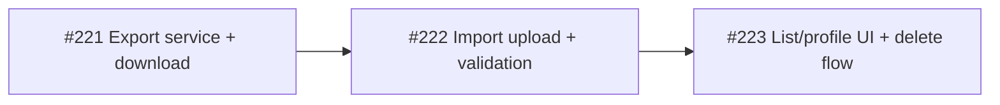

# Patient registration export/import (`.mpx`)

**Product:** Minutriporcion / nutriconsultas — nutritionist web app  
**Status:** Planning (2026-06-18)  
**Track:** `[Nutritionist Web]` — see [`ISSUE-NUTRITIONIST-WEB.md`](../../ISSUE-NUTRITIONIST-WEB.md)  
**Issues:** [#221](https://github.com/diego-torres/nutriconsultas/issues/221) export · [#222](https://github.com/diego-torres/nutriconsultas/issues/222) import · [#223](https://github.com/diego-torres/nutriconsultas/issues/223) UI

---

## Goals

1. **Slot rotation** — Nutritionists on capped plans (#190, e.g. básico = 10 patients) can remove inactive patients without retyping registration data.
2. **Registration-only portable file** — `.mpx` holds YAML profile data suitable for re-import; **clinical history stays in the app until delete** and is **not** in the file.
3. **Safe delete UX** — Deleting a patient warns that history is lost; optional export-before-delete uses the same `.mpx` format.
4. **All plans** — Feature available to every tier; not a paid entitlement.

---

## Non-goals

- Export/import consultation history, diet assignments, measurements over time, or messages
- Patient mobile API endpoints for MPX
- Merge import into an existing `Paciente` row (always creates new record)
- Platform admin bulk retention (#220)

---

## `.mpx` contract (summary)

Full spec: **`docs/paciente/MPX-FORMAT.md`** (authoritative once #221 ships).

| Field | Rule |
|-------|------|
| Extension | `.mpx` |
| Encoding | UTF-8 YAML |
| Version | `mpxVersion: 1` required |
| **In scope** | `Paciente` demographics + `PacienteBodySnapshot` + `PacienteEnergyPreferences` + `PacienteMedicalHistory` |
| **Out of scope** | DB ids, `userId`, `patientAuthSub`, `registro`; all timeline/history entities |

---

## Implementation order

1. **#221** — `PacienteMpxExportService`, download endpoint, tests, `MPX-FORMAT.md`
2. **#222** — parse/validate YAML, `assertCanCreatePatient`, save new entity graph
3. **#223** — Exportar / Eliminar on `/admin/pacientes/**`, SweetAlert copy (Spanish), export-then-delete option

---

## Security & multi-tenant

- Export/delete/import scoped to `paciente.userId == OAuth principal sub` (existing nutritionist tenant model)
- Never log `.mpx` contents or patient names in application logs
- Download over authenticated HTTPS session only

---

## Related docs

- [`ISSUE-NUTRITIONIST-WEB.md`](../../ISSUE-NUTRITIONIST-WEB.md) — issue registry
- [`SUBSCRIPTION-ENFORCEMENT-PLAN.md`](../subscription/SUBSCRIPTION-ENFORCEMENT-PLAN.md) — plan caps (#190)
- [`docs/integration/paciente-er-phase-c.md`](../integration/paciente-er-phase-c.md) — entity decomposition (#156)
