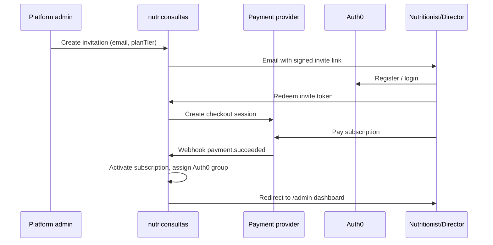
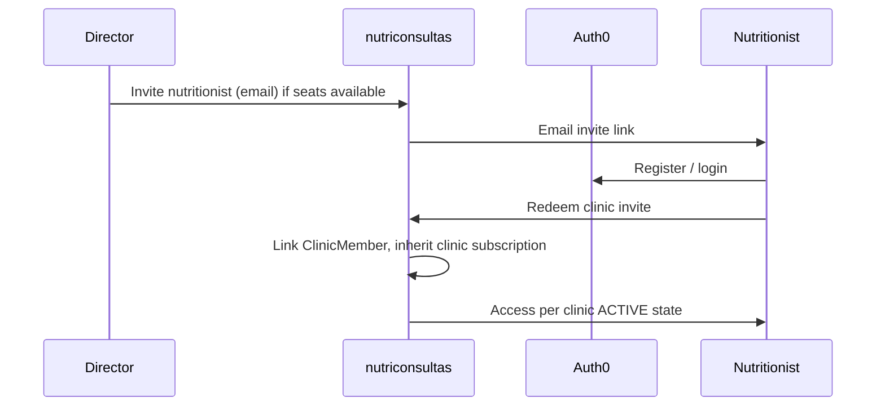
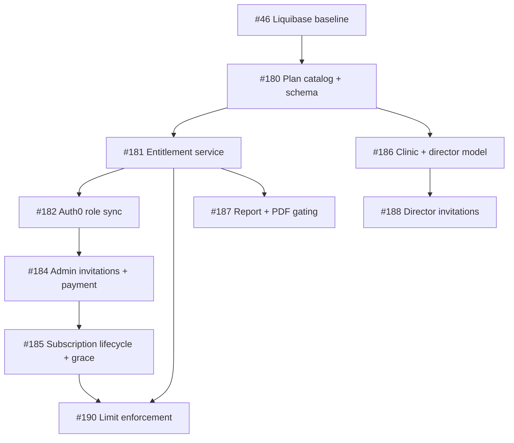

# Subscription & Access Enforcement Plan

**Product:** Minutriporcion / nutriconsultas  
**Status:** Planning (2026-06-16)  
**Track:** `[Subscription]` — parallel to `[Mobile API]` (see [`SUBSCRIPTION-ENFORCEMENT-WORKFLOW.md`](../../SUBSCRIPTION-ENFORCEMENT-WORKFLOW.md))  
**Issue registry:** [`ISSUE-SUBSCRIPTION.md`](../../ISSUE-SUBSCRIPTION.md)

---

## Goals

1. **Platform admins only** — users in `nutriconsultas.platform.admin-user-ids` or `nutriconsultas.platform.admin-emails` are platform administrators (already partially implemented via `PlatformAdminService`).
2. **Role assignment** — admins assign Auth0 groups / application roles: `nutriologo-basico`, `nutriologo-profesional`, `nutriologo-plus`, `director-consultorio`.
3. **Paid onboarding** — admins invite nutritionists and clinic directors; invitation → registration → online payment → monthly subscription with grace period and admin payment overrides.
4. **Clinic hierarchy** — directors invite nutritionists **without** a separate payment flow; directors enable/disable nutritionist access within their clinic.
5. **Plan limits** — enforce patient and nutritionist caps per subscription tier (landing page is source of truth until a dedicated pricing service exists).
6. **Report entitlements** — gate basic / advanced / full reports and PDF export by plan; branded reports use `NutritionistProfile` (logo, display name, cédula).

---

## Non-goals (this epic)

- Patient mobile API changes (`/rest/mobile/patient/**`) — subscription gates the **nutritionist web app** and admin surfaces.
- Replacing Auth0 as identity provider.
- Multi-currency billing beyond MXN (initial target: Mexico).

---

## Existing foundation

| Component | Location | Notes |
|-----------|----------|-------|
| Platform admin allowlist | `PlatformAdminProperties`, `PlatformAdminService` | `admin-user-ids` + `admin-emails`; used today for contact-inquiry admin inbox |
| Multi-tenant patients | `Paciente.userId` | Nutritionist OAuth `sub`; unchanged |
| Nutritionist branding | `NutritionistProfile` | Logo + display name on diet PDFs (#95) and message `senderDisplayName` (#116) |
| Report PDFs | `PatientReportRestController`, `PatientReportService` | Progress, nutrition analysis, clinic statistics — **no plan gating today** |
| Pricing marketing | `templates/eterna/index.html` | Básico $5, Profesional $10, Plus $30, Consultorio $45 / mes |
| Liquibase gate | #46 | Subscription schema lands **after** Liquibase baseline |

---

## Roles & identity model

### Platform administrator

- **Source of truth:** configuration only (`PLATFORM_ADMIN_USER_IDS`, `PLATFORM_ADMIN_EMAILS`).
- **Not** an Auth0 group — avoids privilege escalation via group self-assignment.
- **Capabilities:** assign roles, send paid invitations, set payment-exempt / trial flags, view subscription health, manage grace overrides.

### Application roles (Auth0 groups or app_metadata)

| Role slug | Marketing name | Typical assignee |
|-----------|----------------|------------------|
| `nutriologo-basico` | Básico | Solo nutritionist |
| `nutriologo-profesional` | Profesional | Solo nutritionist |
| `nutriologo-plus` | Plus | Solo nutritionist |
| `director-consultorio` | Consultorio | Clinic director (may also practice as nutritionist) |

**Recommendation:** store canonical plan on `Subscription.planTier` in DB; sync Auth0 group on assign/revoke via Management API (#108 extension). JWT / session carries groups for coarse authorization; DB is authoritative for limits and billing state.

### Clinic hierarchy (`director-consultorio`)

```
Platform
 └── Clinic (subscription owner)
      ├── Director (director-consultorio, billing contact)
      └── Nutritionist seats (0..maxNutritionists-1, invited by director, no separate payment)
```

- One **active subscription** per `Clinic`.
- Solo plans (Básico–Plus): implicit clinic of one user (`maxNutritionists = 1`).
- Consultorio: director manages roster; disabling a nutritionist revokes app access without deleting patient data (soft `membershipStatus`).

---

## Plan entitlements (canonical)

Aligned with [`eterna/index.html`](../../src/main/resources/templates/eterna/index.html) pricing table.

| Entitlement | Básico | Profesional | Plus | Consultorio |
|-------------|--------|-------------|------|-------------|
| `maxPatients` | 10 | 50 | unlimited (`null`) | unlimited |
| `maxNutritionists` | 1 | 1 | 1 | 20 |
| `patientManagement` | ✓ | ✓ | ✓ | ✓ |
| `dietPlans` | ✓ | ✓ | ✓ | ✓ |
| `calendar` | ✓ | ✓ | ✓ | ✓ |
| `reportsBasic` | ✓ | ✓ | ✓ | ✓ |
| `reportsAdvanced` | ✗ | ✓ | ✓ | ✓ |
| `reportsFull` | ✗ | ✓ | ✓ | ✓ |
| `pdfExport` | ✗ | ✓ | ✓ | ✓ |
| `reportsBranded` | ✗ | ✓ | ✓ | ✓ |
| `prioritySupport` | ✗ | ✗ | ✓ | ✓ |
| `userAdministration` | ✗ | ✗ | ✗ | ✓ |

### Report mapping (implementation)

| Marketing | Code flag | Endpoints / UI |
|-----------|-----------|----------------|
| Reportes básicos | `reportsBasic` | In-app progress views, tablero summaries (no PDF) |
| Reportes avanzados | `reportsAdvanced` | Extended analytics sections in `ReportController` views |
| Reportes completos | `reportsFull` | Full patient report HTML views |
| Exportación PDF | `pdfExport` | `GET /rest/reports/patient/{id}`, nutrition PDF, clinic statistics PDF |
| Personalizados (logo + datos) | `reportsBranded` | `NutritionistProfile` header block on PDF templates (already partial) |

Enforcement: central `SubscriptionEntitlementService.hasEntitlement(userId, Entitlement)` called from controllers/services **before** business logic; return **403** with localized message for web, JSON for REST.

---

## Subscription lifecycle

### States

| State | App access | Notes |
|-------|------------|-------|
| `PENDING_PAYMENT` | None (invite + checkout only) | After admin invitation, before first payment |
| `TRIAL` | Full plan entitlements | Admin `paymentExempt=true` or explicit trial end date |
| `ACTIVE` | Full | Paid period current |
| `GRACE` | Read + messaging; **no** new patients / PDF | Configurable `gracePeriodDays` (default 7) after `periodEnd` |
| `SUSPENDED` | Login blocked or redirect to billing | After grace without payment |
| `CANCELLED` | None | Terminal; data retained per retention policy |

### Payment override flag

- `paymentExempt` (admin-set): skips payment provider checks; still respects plan tier limits.
- Use cases: prueba gratuita, prórroga comercial, cuenta interna.
- Audit: `SubscriptionAuditEvent` (who set, when, reason code).

### Platform admin plan tier change (#211)

- **Who:** platform admins only, from `/admin/platform/subscriptions/{id}/edit`.
- **States:** `TRIAL`, `ACTIVE`, `GRACE` only (not `PENDING_PAYMENT`, `SUSPENDED`, `CANCELLED`).
- **Downgrade policy:** **block** when clinic usage exceeds the new plan caps (patient count or active nutritionist seats). Spanish `409` message; no read-only grace on downgrade.
- **Paid subscriptions (MVP):** admin override only — no proration or new checkout (#207 deferred).
- **Auth0:** sync role via Management API (#182); non-fatal failure surfaces admin warning; DB `Subscription.planTier` remains authoritative.
- **Audit:** `PLATFORM_ADMIN_ACTION` with `action=plan.tier.change`, `previousTier`, `newTier`.

### Billing period

- Monthly vigencia from successful payment webhook (or admin trial start).
- Annual prepay (10 months price): extend `periodEnd` by 12 months — marketing only until checkout supports annual SKUs.

### Grace & notifications

Scheduled job (daily):

1. `ACTIVE` → `GRACE` when `now > periodEnd`.
2. Email / in-app banner to nutritionist and director (Consultorio).
3. `GRACE` → `SUSPENDED` when `now > periodEnd + gracePeriodDays`.
4. Reminder at T-7, T-3, T-1 days before `periodEnd` for `ACTIVE`.

**PHI rule:** notifications contain subscription status and billing links only — no patient names.

---

## Invitation flows

### A — Platform admin → nutritionist / director (with payment)



### B — Director → nutritionist (no payment)



Director can `suspend` / `reactivate` members without Auth0 deletion (revoke group or app membership flag).

---

## Payment provider integration

**Decision:** **Stripe** for subscription checkout and recurring monthly billing. Abstract behind `PaymentProvider` interface (existing from #189; Mercado Pago implementation to be replaced in #207):

- `createCheckoutSession(invitationId, planTier, billingInterval)`
- `handleWebhook(payload, signature)`
- `cancelSubscription(externalId)`

Store `externalSubscriptionId`, `externalCustomerId` on `Subscription`. Webhook idempotency table required.

**Stripe references:** [Subscriptions + Checkout](https://docs.stripe.com/billing/subscriptions/checkout), [Webhooks](https://docs.stripe.com/webhooks).

---

## Data model (proposed)

Liquibase changesets after #46 baseline.

| Entity | Purpose |
|--------|---------|
| `PlanTier` | Enum: `BASICO`, `PROFESIONAL`, `PLUS`, `CONSULTORIO` |
| `Subscription` | `clinicId`, `planTier`, `status`, `periodStart`, `periodEnd`, `paymentExempt`, `gracePeriodDays`, payment provider refs |
| `Clinic` | `name`, `directorUserId`, `subscriptionId` |
| `ClinicMember` | `clinicId`, `userId`, `role`, `membershipStatus` (`ACTIVE`/`SUSPENDED`), `invitedBy` |
| `NutritionistInvitation` | Admin-paid flow: token hash, email, `planTier`, `status`, expiry |
| `ClinicInvitation` | Director flow: token hash, email, `clinicId`, expiry |
| `SubscriptionAuditEvent` | Admin actions, webhooks, state transitions |

**Patient count:** `COUNT(paciente WHERE userId IN clinic active members)` vs `maxPatients` on director's plan (Consultorio: aggregate clinic-wide or per-seat — **default: clinic-wide**).

---

## Security requirements

1. Platform admin endpoints: `PlatformAdminService.requirePlatformAdmin(principal)` — never trust client-sent role.
2. Director endpoints: verify `ClinicMember.role=DIRECTOR` and `membershipStatus=ACTIVE`.
3. Invitation tokens: CSPRNG, store SHA-256 hash only (same pattern as patient onboarding #133).
4. Webhook endpoints: signature verification, no CSRF, rate limited.
5. Subscription state checked on **every** authenticated `/admin/**` request (filter or `@PreAuthorize` + service).
6. Grace mode: allow `GET` + patient messages; block `POST` paciente create, PDF generation, new invitations.

---

## Dependencies & build order



**Parallel track note:** `[Mobile API]` #132–#141 patient invitation onboarding is **orthogonal** — do not conflate `NutritionistInvitation` with patient `Invitation`.

---

## Configuration (new properties)

```properties
# Existing
nutriconsultas.platform.admin-user-ids=${PLATFORM_ADMIN_USER_IDS:}
nutriconsultas.platform.admin-emails=${PLATFORM_ADMIN_EMAILS:}

# New (illustrative)
nutriconsultas.subscription.grace-period-days=${SUBSCRIPTION_GRACE_PERIOD_DAYS:7}
nutriconsultas.subscription.payment.provider=${PAYMENT_PROVIDER:stripe}
nutriconsultas.subscription.payment.webhook-secret=${STRIPE_WEBHOOK_SECRET:}
```

---

## Testing strategy

| Layer | Focus |
|-------|-------|
| Unit | `PlanEntitlements`, state machine transitions, limit counters |
| Integration | Webhook handling, invitation redeem, Auth0 group sync (mocked) |
| Security | Non-admin cannot assign roles; director cannot exceed seats; grace blocks PDF |
| E2E | Admin invite → mock payment → login → create patient up to limit |

---

## Open decisions

| # | Question | Default proposal |
|---|----------|------------------|
| 1 | Payment provider | **Stripe** (Checkout + Billing subscriptions) — #207 |
| 2 | Consultorio patient limit | Clinic-wide unlimited (per landing page) |
| 3 | Grace write policy | Block new patients + PDF; allow messages |
| 4 | Auth0 groups vs Roles | Auth0 Roles with RBAC enabled |
| 5 | Annual billing in v1 | Monthly only; annual SKU in v2 |

---

## Related documents

- [`ISSUE-SUBSCRIPTION.md`](../../ISSUE-SUBSCRIPTION.md) — issue registry
- [`SUBSCRIPTION-ENFORCEMENT-WORKFLOW.md`](../../SUBSCRIPTION-ENFORCEMENT-WORKFLOW.md) — agent workflow
- [`ISSUE.md`](../ISSUE.md) — mobile API track (orthogonal)
- [`AGENT-WORKFLOW.md`](../AGENT-WORKFLOW.md) — mobile API agent workflow
